.. _tutorial:

Tutorial
========

In this part of the documentation we try to dive in the functions of itertree in a clear structured way.
The user might look in the
class description of the modules too. But the huge number of methods in the `iTree` class might be very confusing.
We hope these chapters orders the things in a much better way so that the user get's used to the class as
quick as possible.

To understand the functionality of itertree in practice the user might have a look on the related examples
which can be found
in the example folder of itertree.

**Status and compatibility information:**

The original implementation is done in python 3.9 and it is tested under python 3.5 and 3.9. It should work for all
Python-versions  >= 3.4.

From version 1.0.0 on we see the package as released and stable. The unit and integration test suite should target a
huge amount of functionalities and use cases. We will try to keep the interface stable too.

********************************
Quick start - the basics
********************************

We really hope that the usage of the itertree package is intuitive. If the user is familiar with `list` and
`dict` objects the basic functionality should be easy to understand. So don't have any fears about all the details
described in this tutorial you can start quite quick and simple.

Build the object
++++++++++++++++

Each tree item contains two sub-elements the value (data-object) that can be stored in the item and the subtree
of children. The
base class that must be instanced to build the trees is `iTree` and you can simply append sub-items.

.. start: tutorial-code QS1

::
  
  >>> # Instance an iTree object by giving a tag, value and two subtree items (children):
  >>> root = iTree('root', value=0, subtree=[iTree('item0', value=0), iTree('item1', value=1)])
  >>> # append additional child with same tag!
  >>> root.append(iTree('item1', value={'value1':2,'value2':3})) # any object can be used as values
  iTree('item1', value={'value1': 2, 'value2': 3})
  >>> # list like operations are supported; e.g. insert():
  >>> root.insert(2,iTree((1,2), value=3)) # any hashable object can be used as tag
  iTree((1, 2), value=3)
  >>>  # extend the tree by one more level
  >>> root[1].append(iTree('sub_item0',0.1))
  iTree('sub_item0', value=0.1)
  >>> root[-1].append(iTree('sub_item0',4.1))
  iTree('sub_item0', value=4.1)
  >>> root.render()
  iTree('root', value=0)
   > iTree('item0', value=0)
   > iTree('item1', value=1)
   .  > iTree('sub_item0', value=0.1)
   > iTree((1, 2), value=3)
   > iTree('item1', value={'value1': 2, 'value2': 3})
   .  > iTree('sub_item0', value=4.1)
  

.. end - entry created: 2023-06-22T21:38:27

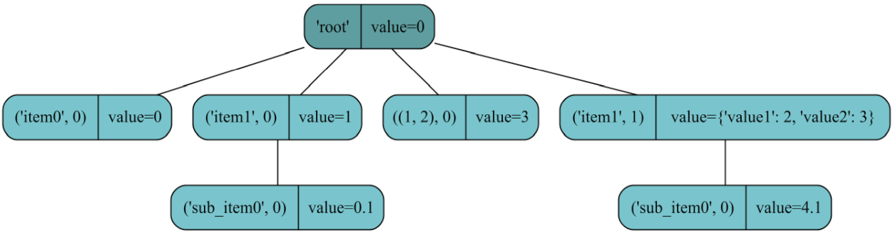

Figure representing the resulting `iTree`-object each item represented by a rounded box
(left-side: tag-idx; right-side: value object)

.. note:: IMPORTANT: In itertree you can append items with the same tag multiple times. Those items are
          collected in a "tag-family". As tag you can use any hashable object.

Access the items
++++++++++++++++

Item access is possible via  `__getitem__(target)`  ( usage via: `my_tree[target]` ). The method supports different types
of targets and delivers returns related to those.

You can target a **single** item via absolute index or you can target it via tag-idx-key (this key is unique).

.. note:: The tag-idx-key is a tuple: `(tag, family-index)` . The family-index is the relative
          index of the item inside the tag-family. Inside the `iTree`-object the children are ordered and they keep the
          same order inside their tag-family.

In case the target is only the tag (without the tag-family-index) the method will deliver the
whole tag-family as a list (multi-items-target).

.. start: tutorial-code QS2

::
  
  >>> # Target a child in the tree via absolute index:
  >>> root[1]
  iTree('item1', value=1, subtree=[iTree('sub_item0', value=0.1)])
  >>> # Target a child in the tree via tag-idx-key:
  >>> root[('item1',0)]
  iTree('item1', value=1, subtree=[iTree('sub_item0', value=0.1)])
  >>> item=root[('item1',1)] # given index is the tag-family index in this case
  >>> item.idx # delivers absolute index of the item
  3
  >>> item.tag_idx # delivers tag-index-key of the item
  ('item1', 1)
  >>> item.parent # delivers the parent object of the item
  iTree('root', value=0, subtree=[iTree('item0', value=0),...,iTree('item1', value={'value1': 2, 'value2': 3}, subtree=[iTree('sub_item0', value=4.1)])])
  >>> # if you give just the family tag without index the whole tag-family is given as a list
  >>> root['item1']
  [iTree('item1', value=1, subtree=[iTree('sub_item0', value=0.1)]), iTree('item1', value={'value1': 2, 'value2': 3}, subtree=[iTree('sub_item0', value=4.1)])]
  

.. end - entry created: 2023-06-22T21:38:27

Iterate over the items
++++++++++++++++++++++

As the name of the package implies we have multiple iterators available.

.. start: tutorial-code QS3

::
  
  >>> # Standard iterator over the children:
  >>> [i.value for i in root]
  [0, 1, 3, {'value1': 2, 'value2': 3}]
  >>> # iteration over items (like in dicts):
  >>> [i for i in root.items()]
  [(('item0', 0), iTree('item0', value=0)), (('item1', 0), iTree('item1', value=1, subtree=[iTree('sub_item0', value=0.1)])), (((1, 2), 0), iTree((1, 2), value=3)), (('item1', 1), iTree('item1', value={'value1': 2, 'value2': 3}, subtree=[iTree('sub_item0', value=4.1)]))]
  

.. end - entry created: 2023-06-22T21:38:27

Copy and Compare
++++++++++++++++

A copy of an `iTree`-objects implies a copy of all children. The compare operation `==` is an in-depth
operation too (compare all children and sub-children inside (same tags, values and order?)). But a
match means "just" that we have an **equal** object and not the **same** object-instance as we see:

.. start: tutorial-code QS4

::
  
  >>> # Copy the iTree:
  >>> new_tree=root.copy()
  >>> # compare:
  >>> new_tree==root
  True
  >>> # and see we have different objects:
  >>> new_tree is root
  False
  >>> # and all sub-items are copied too:
  >>> new_tree[0] is root[0]
  False
  >>> new_tree[1][0] is root[1][0]
  False
  

.. end - entry created: 2023-06-22T21:38:27

In-depth operations
++++++++++++++++++++

The itertree is a nested tree-structure and it supports in-depth operations out of the box. As we have already seen some
functions in the base-class contains direct in-depth support
(we saw already `copy()`, `==` and now follows the important function `get()`).

Additional in-depth functionalities (especially deep-iterators) can be found in the sub-class `iTree.deep`.

.. start: tutorial-code QS5

::
  
  >>> # To access items in-depth target_paths can be given as parameters to get()
  >>> target_item=root.get(('item1',1),0) # target types can be mixed (e.g. tag-idx and absolute index)
  >>> # Get method delivers flatten lists in case multiple items are targeted (even in higher levels)
  >>> root.get('item1',0) # delivers all matches in deepest level!
  [iTree('sub_item0', value=0.1), iTree('sub_item0', value=4.1)]
  >>> # other in-depth operation are found via .deep:# contains (target-item of first get operation):
  >>> target_item in root # item is not a level 1 child!
  False
  >>> target_item in root.deep # but item is part of the tree (in-depth)
  True
  >>> # size:
  >>> len(root)
  4
  >>> len(root.deep)
  6
  >>> # flatten iterators over all in-depth items:
  >>> [i for i in root.deep] # up-down order
  [iTree('item0', value=0), iTree('item1', value=1, subtree=[iTree('sub_item0', value=0.1)]), iTree('sub_item0', value=0.1), iTree((1, 2), value=3), iTree('item1', value={'value1': 2, 'value2': 3}, subtree=[iTree('sub_item0', value=4.1)]), iTree('sub_item0', value=4.1)]
  >>> [i for i in root.deep.tag_idx_paths(up_to_low=False)] # tag_idx related iterator; down-up order
  [((('item0', 0),), iTree('item0', value=0)), ((('item1', 0), ('sub_item0', 0)), iTree('sub_item0', value=0.1)), ((('item1', 0),), iTree('item1', value=1, subtree=[iTree('sub_item0', value=0.1)])), ((((1, 2), 0),), iTree((1, 2), value=3)), ((('item1', 1), ('sub_item0', 0)), iTree('sub_item0', value=4.1)), ((('item1', 1),), iTree('item1', value={'value1': 2, 'value2': 3}, subtree=[iTree('sub_item0', value=4.1)]))]
  

.. end - entry created: 2023-06-22T21:38:27

Save and load
+++++++++++++

The itertree package delivers a standard serializer which stores the `iTree`-object in a JSON formatted file. It
supports the serialization of more complex value-objects (e.g. numpy-arrays).

.. start: tutorial-code QS6

::
  
  >>>  # save tree to file
  >>> root.dump('dt.itz',overwrite=True) # returns the sha1 hash of the tree stored in the file
  fb2a60c29acc2119363831ad1039c00836e55d15eb36955617d1c913f86dc8eb
  >>>  # load tree from file
  >>> loaded_tree=iTree().load('dt.itz')
  >>> loaded_tree==root
  True

.. end - entry created: 2023-06-22T21:38:27

.. note:: The `iTree`-class uses iterative and no recursive algorithms. The advantage is that the object
          will not raise RecursionErrors even if user defines very deep trees
          (e.g. see the performance-analysis with a tree depth of 1000 levels). To keep the functionality for
          the stored data the serializer creates a flat list of entries (which avoids RecursionErrors related to the JSON parser).

Next steps
+++++++++++++

After those basic functions are learned you may be motivated to dive deeper. E.g. learn more about possible
targets related to item access, linking trees and branches, search/filter in the trees and store more advanced
datatypes in the tree.

In the tutorial you can find a large table which compares `iTree` with `dict` and `list` objects
(link can be found in next chapter).

********************************
Introduction to the iTree object
********************************

As a starting point the `iTree`-class should be seen as a `list` (the object inherits his functions
from a `list` or `blist`). All typical `list` like methods are available. But `iTree`-objects supports also in-depth
access and iterations over different levels of the nested tree structure. Different than in normal lists the
`iTree`-class supports the more `dict`-like access functions related to keys too.

For a functional comparison in between `ìTree`, `list` and `dict` the table in the chapter
`Comparison of the iTree object with lists and dicts`_ might be interesting for the reader.

Same tags and tag-families
++++++++++++++++++++++++++

The children items of a `iTree`-object with the same tag are collected in a related tag-family. Inside the family each
item contains a related index (relative index). The items can be targeted by giving the family-tag and
the **family-index**
as a tuple. This `tag_idx`-pair is a unique `key` inside the children of a parent. Each item in a nested
`iTree`-structure contains a unique `tag_idx_path` from the root object (or any parent (relative path)).
The `tag_idx_path` property of an item
contains all `tag_idx`'s from the root item over all parents
to the item itself (the `tag_idx_path` is represented by a `tuple` of `tag_idx` items).

Beside this more key-like targeting we can target an item via the **absolute** index too (`idx` or `idx_path`). The
access is made here like it is known from lists. The `idx_path` is again represented as a tuple of index numbers.

It's important that the user understands the difference between the **absolute** index and the **family-index**.

The things might getting clearer if we look into the order structure of an `iTree`-object:

The tree items of one level are ordered
globally like in a `list` and the same order of items will be found in the tag related family too. The order is not
independent because an item which is a predecessor of another item in the tag-family will be found before the
item in the global order too. But from the global/absolute view there might be other items (with other tags)
inbetween. They are not seen in the family because they have other tags!

.. list-table::

 * - **abs-order**
   - **family "a"**
   - **family "b"**
 * - | iTree(tag='a',value=1)
   - | iTree(tag='a',value=1)
   - |
 * - | iTree(tag='b',value=2)
   - |
   - | iTree(tag='b',value=2)
 * - | iTree(tag='a',value=3)
   - | iTree(tag='a',value=3)
   - |
 * - | iTree(tag='b',value=4)
   - |
   - | iTree(tag='b',value=4)

Normally the tag must be given to the item when it is instanced. As tag-objects the user can give any hashable object
(e.g. tuples, int, float, str, bytes). If no tag is given the `iTree`-object will use the default `NoTag`-object
as tag. In `iTree` exists a  `rename()` method to change the tag of an item, but if possible this should be avoided
because it implies a reordering of the items inside the effected tag-families (removed tag and new tag).

Unique parent principle
++++++++++++++++++++++++++

We have one important limitation related to `iTree` objects, each one can only be the child of **ONE PARENT ONLY!**

If the users
tries to append an `iTree`-object that is already a child of an `iTree` to another `iTree` a `RecursionError` will be
raised.

Only if the `iTree` referencing feature `iLink()` is utilized the share of same objects in different tree-sections
is possible.

To avoid issues in some multi-item-functions implicit copies are created automatically (e.g.: `my_tree.extend(itree)` or
rearrangements via `itree[1],itree[2]==itree[2],itree[1]` or
multiplications like `my_tree= itree * 10`).

.. note:: The terms `itree` and `my_tree` are used as examples of instanced objects in this tutorial.

In case of implicit copies the objects `copy()`-method will be used. The method is an in-depth copy of all sub-items
(required because of one parent only principle) and the method creates also a copy of the stored
value object (top-level-only). It is an iterative equivalent to the operation:

::

    new_itree=iTree(itree.tag,copy.copy(itree.value), subtree=[i.copy() for i in itree])

.. warning:: If it is required to keep the original objects the operations:

             * multiplication of `iTree`-objects
             * build `iTree`-object based of children of another `iTree` (e.g. `new_tree=iTree(subtree=old_tree)`)
             * rearrangements like `itree[1],itree[2]==itree[2],itree[1]`

             must be avoided!

Naming conventions
++++++++++++++++++++++++++

In the itertree package and this tutorial the following naming convention is used:

* **item**
    An item is an `iTree` object that is a child (sub-element) of an `iTree` parent object somewhere
    inside the nested tree structure.

* **parent**
    The current object can be the child of a specific parent or it has no parent. A child can have only one parent.
    All parent
    related properties will deliver `None` in case no parent is coupled to the object
    (e.g. `itree.idx`, `itree.key`,`itree.parent`, ...).

* **child**
    An `iTree` object that has a parent. This object is part of the parents children and it is related to the absolute
    order of them and to its family siblings.

* **root**
    For nested children in sub-sub-trees the root is
    the top level parent.
    Any `iTree` object that has no parent is a root object itself.

* **family**
    The group (`list`) of children in an `iTree` that have the same tag (The children have same order in the family
    as in `iTree`-object (absolute order)).

* **tag**
    The tag is a object that defines that the item is part of a specific family. If no tag is given automatically
    the `NoTag` object will be used as tag. The user can use any hashable object as a tag for an `iTree`-object.

* **idx**
    Specific (unique) index of a children related to the absolute order of the `iTree`'s children (list like access)

* **tag-idx**
    Specific (unique) tuple of family-tag and family-index of an ´iTree´ child (sometimes named tag-idx-key).

* **idx_path**
    Specific (unique) tuple of indexes (index per level) describe the path from the root parent object to the
    specific nested child
    somewhere deep in the `iTree` object.
    E.g `(0,1,0)` targets:

        * 0. element (level 0) ->
        * 1. element (level 1) ->
        * 0. element (level 2)

    In access function the relative idx_path from the current object to the sub-item must be given
    (not the absolute path (might be used if you target via `itree.root.get(*idx_path)`)).

* **tag_idx_path**
    List of tag-idx-keys (unique tuples of family-tag,family-index) describe the path from the root
    object to the specific nested child somewhere deep in the `iTree` object.
    E.g `(('tag1',0),(NoTag,1),(1.6,0))` targets:

        * 0. element in tag-family 'tag1' (level 0) ->
        * 1. element in tag-family NoTag (level 1) ->
        * 0. element in tag-family 1.6 (level 2)

    In access function the relative tag_idx_path from the current object to the sub-item must be given
    (not the absolute path (might be used if you target via `itree.root.get(*tag_idx_path)`)).

* **target**
    Is an object that targets one or multiple items in an `iTree` the target is used related to one level only. But
    to reach deeper levels the user can create based on targets target_paths (list of targets).

    The common access methods `__getitem__()` , `get()` are sensitive related to the given target and a
    related object will be returned:

        * Single target definitions deliver a single item.
        * Multi target definitions deliver a `list` (or `blist` ) of items.

    Possible target definitions are:

    * index - absolute target index integer (fastest operation) -> unique/single result

    * key - key tuple (family_tag, family_index) -> unique/single result

    * tag-set - {family_tag} object targeting a whole family -> list result

    * tag-sets - {family_tag,family-tag2,...} object targeting multiple families -> list result

    * target-list - indexes or keys or other targets (mixed lists support). Selects items in **same level** based given target-list -> list result

    * index slice - slice of absolute indexes -> list result

    * key slice - tuple of of (family_tag, family_index_slice)  -> list result

    * filter_method - a filtering method that delivers True/False related to an analysis of item properties  -> list result

    * iter_method - if build-in `iter` is given a list of all children will be delivered (same like `list(itree.__iter__()`)

    * Ellipsis - if Ellipsis `...` is given a list of all children will be delivered (same like `itree[:]`)

* **target-path**
    The target-path is a list of targets and it is used for in-depth operations over the different nested levels
    of the tree. Most often
    (e.g. `get(*target_path)`) the target-path is given as a pointer argument to the method.

    .. note:: Please understand the difference in between a target-list and a target_path.

               * target-list -> targets items in the **same level** (siblings)
               * target-paths -> targets items in **different nested levels**, this is an in-depth access

              In the related methods (e.g. `get()`) target-list are given as one parameter
              but target_paths are given as multiple parameters.

               * `itree.get([1,2,3])~[itree[1],itree[2],itree[3]]` -> targets the children [1][2][3] in level 1
               * `itree.get(*[1,2,3])~itree[1][2][3]` -> targets the item [1] in level 1, [2] in level 2 and [3] in level 3

              If the user defines a target-path like `my_path=[[1,2],[0,1]]` the object will be seen as a
              target_path of target_list-targets.
              E.g. such a list can be used in `my_tree.get(*my_path))` (give pointer). The input is the same like
              `get([1,2,3,4],[9,10])`. The result of the request is a flatten iterator over all matches in the deepest
              requested level but it will considering all multi-matches in the levels inbetween too.

              .. start: tutorial-code 0

              ::
                
                >>> root = iTree('root')
                >>> root.append(iTree('a', value={'mykey': 1}, subtree=[iTree('a1'), iTree('a2')]))
                iTree('a', value={'mykey': 1}, subtree=[iTree('a1'),iTree('a2')])
                >>> root.append(iTree('a', value={'mykey': 1}, subtree=[iTree('a1'), iTree('a2')]))
                iTree('a', value={'mykey': 1}, subtree=[iTree('a1'),iTree('a2')])
                >>> root.get([0, 1], [0, 1])
                [iTree('a1'), iTree('a2'), iTree('a1'), iTree('a2')]
                

            .. end - entry created: 2023-06-22T21:38:27

            .. figure:: resources/tutorial_0.png
               :align: center

               Figure showing the resulting iTree

* **value**
    The value is the a data-object that can be stored in a `iTree`-object

*Name extensions:*

* **s**
     If plural is used in method names this is a hint that the method return will be an iterator:
     e.g.: `itree.keys()`; `itree.values()`; `itree.items()`; `itree.deep.tag_idx_paths()`; `itree.deep.idx_paths()`

* **_path**
     The extension is used for parameters and properties. This means that the parameter is an iterable that targets
     the different levels of the nested structure (in-depth access).
     e.g. `get(*target_path)`

* **filter_method**
    A method that check the match of a `iTree`-item related to a property and the method delivers True/False if
    an `iTree`-item is given as parameter. Therefore the method can be used for the filtering of items.

*Internal helper classes:*

* **.deep**
    Helper class contains the in-depth functions that targets all elements inside the `iTree`-object. E.g. the
    class contains different flatten iterators that iterates over all nested items of the `iTree`-object.
    The class contains no `__getitem__()` method for in-depth item access because the function is already covered
    by the standard `get()` and `get_single()` methods. The available `get()`-method is the same as the
    `get()`-method in the base class.
    (in detail: `iTree full overview over the in-depth functionalities`_)

* **.getitem**
    Helper class that contains a lot of specific getitem methods f<or the different possible targets.
    (in detail: `Item Access`_)

***************************
Construction of an itertree
***************************

The first step in the construction of a itertree is to instance the main itertree class: `iTree`.

.. autoclass:: itertree.iTree

Instance the `iTree` object:

.. start: tutorial-code 2

::
  
  >>> item1 = iTree('item1')  # itertree item with the tag 'item1'
  >>> item2 = iTree('item2', 2)  # instance a iTree-object with value content integer 2
  >>> item2b = iTree('item2', {'mykey': 2})  # instance a iTree-object with a dict as value content
  >>> item3 = iTree()  # instance an iTree-object with the default tag (==NoTag) and no data content (==NoValue)
  >>> root = iTree('root', subtree=[item1, item2, item2b, item3])
  >>> root.render()
  iTree('root')
   > iTree('item1')
   > iTree('item2', value=2)
   > iTree('item2', value={'mykey': 2})
   > iTree()
  

.. end - entry created: 2023-06-22T21:38:27

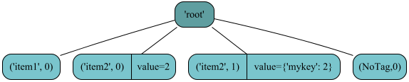

   Figure showing the resulting iTree

.. itree_docu_example.py: tutorial 2

To include `iTree`-objects as a children in a parent object we have several possibilities, those
functionalities are comparable to the same methods you find in `list`-objects.

.. start: tutorial-code 3a

::
  
  >>> root = iTree('root')
  >>> root.append(iTree('child'))  # append a child
  iTree('child')
  >>> # The append operation delivers the appended object back
  >>> root += iTree('child')  # alternative way to append a child
  >>> root.append('value_content')  # append a child with implicit iTree(tag=NoTag,value='value_content')
  iTree(value='value_content')
  >>> root.insert(1, iTree('child','inserted'))  # insert the item in the given target position (the insert is done in this target (index)
  iTree('child', value='inserted')
  >>> # the old item with given target (index) will be moved in next position
  >>> root.render()
  iTree('root')
   > iTree('child')
   > iTree('child', value='inserted')
   > iTree('child')
   > iTree(value='value_content')
  >>> root[0] = iTree('newchild')  # replace the child with index 0
  >>> root.render()
  iTree('root')
   > iTree('newchild')
   > iTree('child', value='inserted')
   > iTree('child')
   > iTree(value='value_content')
  >>> del root[('newchild', 0)]  # deletes the child with key=('newchild',0) family-tag='newchild' and family-index=0
  >>> root.render()
  iTree('root')
   > iTree('child', value='inserted')
   > iTree('child')
   > iTree(value='value_content')
  >>> del root[1]  # deletes the child with absolute index 1
  >>> root.render()
  iTree('root')
   > iTree('child', value='inserted')
   > iTree(value='value_content')
  >>> # The tag can be any hashable type!
  >>> root.append(iTree(1))  # append a child with tag 1
  iTree(1)
  >>> root.append(iTree((1, 2, 3)))  # append a child with tag (1,2,3)
  iTree((1, 2, 3))
  >>> root.append(iTree((1, 2, 3), 1))  # append a child with tag (1,2,3) and data content 1
  iTree((1, 2, 3), value=1)
  >>> root.render()
  iTree('root')
   > iTree('child', value='inserted')
   > iTree(value='value_content')
   > iTree(1)
   > iTree((1, 2, 3))
   > iTree((1, 2, 3), value=1)
  >>> new_itree = iTree()
  >>> root.append(new_itree)
  iTree()
  >>> root.append(new_itree)  # appending same object again will not work because parent is already set
  Traceback (most recent call last):
  ...
  RecursionError: Given item has already a parent iTree!

.. end - entry created: 2023-06-22T21:38:27

Remember if a tag is appended in an object where already exists a child with same
tag this/those child/children will not be overwritten!
Furthermore all items
with same tags are collected in the same tag-family:

.. start: tutorial-code 3b

::
  
  >>> family=root[{(1,2,3)}] # target the family with a set(): {(1,2,3)}
  >>> family # is represented as a list of the related items (with same tag)
  [iTree((1, 2, 3)), iTree((1, 2, 3), value=1)]
  >>> family=root.get.by_tag((1,2,3)) # target via the süecial tag access function
  >>> family # is represented as a list of the related items (with same tag)
  [iTree((1, 2, 3)), iTree((1, 2, 3), value=1)]
  

.. end - entry created: 2023-06-22T21:38:27

Additionally a huge set of methods is available for structural manipulations related to the children of a item.

.. autofunction:: itertree.iTree.append()
            :noindex:

.. autofunction:: itertree.iTree.__iadd__()
            :noindex:

.. autofunction:: itertree.iTree.appendleft()
            :noindex:

.. autofunction:: itertree.iTree.extend()
            :noindex:

.. autofunction:: itertree.iTree.extendleft()
            :noindex:

.. autofunction:: itertree.iTree.insert()
            :noindex:

.. autofunction:: itertree.iTree.move()
            :noindex:

.. autofunction:: itertree.iTree.rename()
            :noindex:

.. autofunction:: itertree.iTree.pop()
            :noindex:

**************************************
iTree other structure related commands
**************************************

.. autofunction:: itertree.iTree.__setitem__()
            :noindex:

.. autofunction:: itertree.iTree.__delitem__()
            :noindex:

.. autofunction:: itertree.iTree.clear()
            :noindex:

.. autofunction:: itertree.iTree.copy()
            :noindex:

.. autofunction:: itertree.iTree.copy_keep_value()
            :noindex:

.. autofunction:: itertree.iTree.deepcopy()
            :noindex:

The copy operations are automatically in-depth operations this means the items in the subtree will be copied too. This
is required because of the one parent only principle. The available copy operations making a difference in
the treatment of the `itree.value`-object:

    * `copy()` - creates a top-level copy of the value object
    * `copy_keep_values()` - copies just the `iTree` object but keep the value
    * `deepcopy()` - creates a deepcopy of the value object

The methods of the `copy`  package use the same functionalities  `copy.copy(itree) ~ itree.copy()`
and `copy.deepcopy(itree) ~ itree.deepcopy()`.

.. start: tutorial-code 3_1

::
  
  >>> import copy
  >>> itree = iTree('root',value={'a':[1,2,3]})
  >>> copied_itree=itree.copy()
  >>> iTree(itree.tag,value=copy.copy(itree.value)) # root only copy (subtree eliminated)
  iTree('root', value={'a': [1, 2, 3]})
  >>> copied_itree.value is itree.value
  False
  >>> copied_itree.value['a'] is itree.value['a']
  True
  >>> deepcopied_itree=itree.deepcopy() # Inner values objects will be copied too
  >>> deepcopied_itree_extern=iTree(itree.tag,value=copy.deepcopy(itree.value)) 
  >>> deepcopied_itree.value is itree.value
  False
  >>> deepcopied_itree.value['a'] is itree.value['a']
  False
  >>> itree_only_copy=itree.copy_keep_value() # values will be taken over without copy
  >>> itree_only_copy_extern=iTree(itree.tag,value=itree.value) 
  >>> itree_only_copy.value is itree.value
  True
  

.. end - entry created: 2023-06-22T21:38:27

Some of the structural manipulation commands can be utilized also as an in-depth variant which will run over
the nested `iTree`-structure. Use the helper class `.deep` for this propose.

.. autofunction:: itertree.iTree.rotate()
            :noindex:

.. autofunction:: itertree.iTree.reverse()
            :noindex:

.. function:: itertree.iTree.deep.reverse()
coded in helper-class:

.. autofunction:: itertree.itree_indepth._iTreeIndepthTree.reverse()
            :noindex:

.. autofunction:: itertree.iTree.sort()
            :noindex:

.. function:: itertree.iTree.deep.sort()
coded in helper-class:

.. autofunction:: itertree.itree_indepth._iTreeIndepthTree.sort()
            :noindex:

Additionally we support following rearrangement functions:

.. start: tutorial-code 3c

::
  
  >>> root[0], root[1], root[2] = root[2], root[0], root[1]
  >>> root[0:3] = root[2], root[0], root[1]
  Traceback (most recent call last):
    File "E:\projects\privat\itertree\src\itertree\examples\itree_docu_examples.py", line 125, in exec_and_print
      result = eval(command)
    File "<string>", line 1
      root[0:3] = root[2], root[0], root[1]
                ^
  SyntaxError: invalid syntax
  
  During handling of the above exception, another exception occurred:
  
  Traceback (most recent call last):
    File "E:\projects\privat\itertree\src\itertree\examples\itree_docu_examples.py", line 130, in exec_and_print
      exec(command)
    File "<string>", line 1, in <module>
    File "E:\projects\privat\itertree\src\itertree\itree_main.py", line 1441, in __setitem__
      return [it_setitem(old_items[i].idx, new) for i, new in enumerate(value)]
    File "E:\projects\privat\itertree\src\itertree\itree_main.py", line 1441, in <listcomp>
      return [it_setitem(old_items[i].idx, new) for i, new in enumerate(value)]
    File "E:\projects\privat\itertree\src\itertree\itree_main.py", line 1473, in __setitem__
      old_item_idx = family[0].idx
  IndexError: list index out of range
  
  >>> root[2], root[0], root[1] = root[0:3]

.. end - entry created: 2023-06-22T21:38:27

There might be cases where those in-place rearrangements might not work (We have not tested all possible
combinations here) and
be aware that in this kind of operations it can be that there are implicit copies (same as `itree.copy()`) of the
original object-instances created.

In the following pseudo mathematical operations the result will always be a new `iTree` instance. Flags are
not considered in those operations. Addition and multiplication is not permutable because the first object
gives the tag,value for the resulting object!

The addition of `iTree`'s is possible the result contains always the properties of the first added item and the
children of the second added item are appended to the items of the fiorst one by creating a copy.

.. start: tutorial-code 4

::
  
  >>> a = iTree('a', value={'mykey': 1}, subtree=[iTree('a1'), iTree('a2')])
  >>> b = iTree('b', subtree=[iTree('b1'), iTree('b2')])
  >>> itree = a + b
  >>> repr(itree) # repr() is required to get the un-shorten representation of iTree (str() shortens the subtree-parameter)
  iTree('a', value={'mykey': 1}, subtree=[iTree('a1'), iTree('a2'), iTree('b1'), iTree('b2')])

.. end - entry created: 2023-06-22T21:38:27

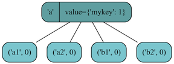

   Figure showing the resulting iTree

Multiplication of a `iTree` is possible too the result is a list of `iTree` copies of the original one.

.. start: tutorial-code 5

::
  
  >>> itree_list = iTree('a') * 1000  # creates a list of 1000 copies of the original iTree
  >>> itree_list[0]==itree_list[1] # items are equal
  True
  >>> itree_list[0] is itree_list[1] # but we have different instances
  False
  >>> root = iTree('root')
  >>> root.extend(iTree('a') * 10000) # append all 10000 items as children to root
  >>> len(root)
  10000

.. end - entry created: 2023-06-22T21:38:27

In case two `iTree`-objects are multiplied in the result each children of first will be mixed with the
children of the second in the scheme:
child1_0,child2_0,child1_0,child2_1,...child1_1,child2_0,child1_1,child2_1...

.. start: tutorial-code 6

::
  
  >>> itree1=iTree('one',1,[iTree(1.0),iTree(1.1),iTree(1.2)])
  >>> itree2=iTree('two',1,[iTree(2.0),iTree(2.1),iTree(2.2)])
  >>> itree_mul=itree1*itree2
  >>> itree_mul.render()
  iTree('one', value=1)
   > iTree(1.0)
   > iTree(2.0)
   > iTree(1.0)
   > iTree(2.1)
   > iTree(1.0)
   > iTree(2.2)
   > iTree(1.1)
   > iTree(2.0)
   > iTree(1.1)
   > iTree(2.1)
   > iTree(1.1)
   > iTree(2.2)
   > iTree(1.2)
   > iTree(2.0)
   > iTree(1.2)
   > iTree(2.1)
   > iTree(1.2)
   > iTree(2.2)

.. end - entry created: 2023-06-22T21:38:27

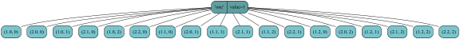

   Figure showing the resulting iTree after multiplication

The subtraction of two iTrees is supported too. The base of operation is the tag_idx of the items. Items with same
tag_idx are
eliminated (only in case they have same value too). With different values we try to calculate the the difference of the
value objects if this is not possible the value will kept unchanged (value of the minuend is kept).

.. start: tutorial-code 7

::
  
  >>> itree1=iTree('one',1,[iTree('a',1.0),iTree('a',1.1),iTree('a','str')])
  >>> itree1[0]-itree1[1] # same tage different value -> diff of value is calculated (if possible)
  iTree(value=-0.10000000000000009)
  >>> itree1[0]-itree1[2] # same tage different value -> diff not possible minuend is kept
  iTree(value=1.0)
  >>> sub_tree=itree1-itree1 # minus same object
  >>> sub_tree.tag # tag eliminated
  <class 'itertree.itree_helpers.NoTag'>
  >>> sub_tree.value # value eliminated
  <class 'itertree.itree_helpers.NoValue'>
  >>> sub_tree.render() # subtree eliminated
  iTree()

.. end - entry created: 2023-06-22T21:38:27

Subtraction of same iTree delivers an empty iTree object (tag=NoTag; value=NoValue).

***************************
Item Access
***************************

In this chapter we will dive in the "magic" of the `iTree.get` object.

The user can choose in between the common and the specific target access. The common access is more flexible
related to the possibility of giving mixed target_paths and it is a bit more "lazy". The specific access should be used
if the quickest possible access is required (depending on the given target type it is ~2-6 times quicker
compared to the common access). And it can be that the specific access is needed because of conflicting target content
(e.g. if an integer tag is used in iTree, it cannot be reached via common access because
the target will be interpreted as an absolute index access (higher priority the tag access))

.. note:: The common target access is also used when ever a item must be targeted in other functionalities
          like `move()` or `insert()`!

For common target access we have the following methods:

.. autofunction:: itertree.iTree.__getitem__()
            :noindex:

.. function:: itertree.iTree.get()
coded in helper-class:

.. autofunction:: itertree.itree_getitem._iTreeGetitem.__call__()
            :noindex:

.. function:: itertree.iTree.get.single()
coded in helper-class:

.. autofunction:: itertree.itree_getitem._iTreeGetitem.single()
            :noindex:

.. function:: itertree.iTree.get.iter()
coded in helper-class:

.. autofunction:: itertree.itree_getitem._iTreeGetitem.iter()
            :noindex:

The first method `__getitem__()` targets first level only (access via "brackets-operation" `itree[]`).
All other methods are capable to target via in-depth access
(realized via multiple parameters that can be given to the method).

.. warning:: The usage of target_paths are just supported by the `get`-subclass. The following
             methods supporting target-paths containing mixed target-items (different types):

             * `get()`
             * `get.single()`
             * `get.iter()`

             The other methods in `get`-subclass support only target-paths with unique targets (matching to the
             specific method).

             The method `__getitem__()` does not support target-paths it just takes targets targeting
             the level 1 children only!

The return type of the common access functions `__getitem__()`and `get()` depends on the given target-type:

    * absolute index, key (family tag-index pair) -> unique `iTree`-item will be delivered
    * all other targets (multi target operations) -> `list` of matching items (in some case a `blist` object might be delivered)

The `get.single()` method delivers only single `iTree`-objects and `get.iter()` delivers an iterator of the
matches found.

For the specific access the following methods are available:

.. function:: itertree.iTree.get.by_idx()
coded in helper-class:

.. autofunction:: itertree.itree_getitem._iTreeGetitem.by_idx()

.. function:: itertree.iTree.get.by_idx_slice()
coded in helper-class:

.. autofunction:: itertree.itree_getitem._iTreeGetitem.by_idx_slice()

.. function:: itertree.iTree.get.by_idx_list()
coded in helper-class:

.. autofunction:: itertree.itree_getitem._iTreeGetitem.by_idx_list()

.. function:: itertree.iTree.get.by_tag_idx()
coded in helper-class:

.. autofunction:: itertree.itree_getitem._iTreeGetitem.by_tag_idx()

.. function:: itertree.iTree.get.by_tag_idx_slice()
coded in helper-class:

.. autofunction:: itertree.itree_getitem._iTreeGetitem.by_tag_idx_slice()

.. function:: itertree.iTree.get.by_tag_idx_list()
coded in helper-class:

.. autofunction:: itertree.itree_getitem._iTreeGetitem.by_tag_idx_list()

.. function:: itertree.iTree.get.by_tag()
coded in helper-class:

.. autofunction:: itertree.itree_getitem._iTreeGetitem.by_tag()

.. function:: itertree.iTree.get.by_tags()
coded in helper-class:

.. autofunction:: itertree.itree_getitem._iTreeGetitem.by_tags()

.. function:: itertree.iTree.get.by_level_filter()
coded in helper-class:

.. autofunction:: itertree.itree_getitem._iTreeGetitem.by_level_filter()

Target description
+++++++++++++++++++

Beside the construction of the object the access to it's items is the second core-functionality for a tree object.

In `iTree` this is one of the most complex functionalities available. The reason is the wide range of
different possible targets that are supported. It's recommended that the user reads the following
explanations and examples carefully
to understand the full range of functionalities available related to the access of children stored in `iTree`.

But even for less experienced users the easy access via `itree[index]` (list like counterpart) or
`itree[tag_idx_key]` (dict-like counterpart) will work in most cases.

Lets build a small example `iTree`-object and let's see with which target definitions we can access
the children in this object:

.. start: tutorial-code 8

::
  
  >>> root = iTree('root')
  >>> root += iTree('child', value=0)
  >>> root += iTree('child', value=1)
  >>> root += iTree('child', value=2)
  >>> root += iTree('child', value=3)
  >>> root += iTree('child', value=4)
  >>> root += iTree(1, value=5)
  >>> root += iTree(('child',1), value='tag conflict')
  >>> # any hashable object can be used as tag!
  >>> root += iTree((1, 2, 3), value=6)  # any hashable object can be used as tag!
  >>> root.render()
  iTree('root')
   > iTree('child', value=0)
   > iTree('child', value=1)
   > iTree('child', value=2)
   > iTree('child', value=3)
   > iTree('child', value=4)
   > iTree(1, value=5)
   > iTree(('child', 1), value='tag conflict')
   > iTree((1, 2, 3), value=6)
  

.. end - entry created: 2023-06-22T21:38:27

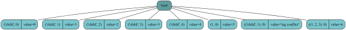

    Figure showing the resulting iTree

In the following examples have a special look on the result types delivered (single-targets ->
`iTree`-child and  multi-targets -> `list` of matching
children in `iTree`-order):

    * Target via **absolute index**:

      The absolute index is like the index in lists and targets the children counting from 0.
      And as in lists negative values are supported too (count index from the last index down).

      This operation is the fastest way to target a item in `iTree`-objects.

      This operation has highest priority in common access. It will "cover" the tag access to
      families (based on integer-type tags).

      The specific access method `get.by_idx()` is faster and can be used too.

      This is a single/unique target therefore it delivers directly the targeted  `iTree`-child-object.

      .. start: tutorial-code 8_1

      ::
        
        >>> # Common index access:
        >>> root[0] # absolute index access
        iTree('child', value=0)
        >>> root[-1] # absolute index access (negative values)
        iTree((1, 2, 3), value=6)
        >>> root[5] # This child is not targeted in the next step even that it's tag==1!
        iTree(1, value=5)
        >>> root[1] # The absolute index access has higher priority than access via tags
        iTree('child', value=1)
        >>> # Specific index access:
        >>> root.get.by_idx(0) # absolute index access
        iTree('child', value=0)
        >>> root.get.by_idx(-1) # absolute index access (negative values)
        iTree((1, 2, 3), value=6)
        >>> root.get.by_idx(5) # This child is not targeted in the next step even that it's tag==1!
        iTree(1, value=5)
        >>> root.get.by_idx(1) # The absolute index access has higher priority than access via tags
        iTree('child', value=1)
        

    .. end - entry created: 2023-06-22T21:38:27

    * Target via **absolute index-slice**:

      As in lists the slicing of the absolute index is supported too.

      But the result is no
      more unique, therefore the operation will return a `list` or `blist`.

      The specific access method for this target is `get.by_idx_slice()`
      but the method parameter(s) must be slice object(s).

      .. start: tutorial-code 8_2

      ::
        
        >>> # Common index-slice access:
        >>> root[1:3]
        blist([iTree('child', value=1), iTree('child', value=2)])
        >>> # Specific index-slice access:
        >>> root.get.by_idx_slice(slice(1,3))
        blist([iTree('child', value=1), iTree('child', value=2)])
        

    .. end - entry created: 2023-06-22T21:38:27

    * Target via **absolute index-list**:

      We can target multiple children by giving a list of indexes.
      The resulting list represents the order of indexes the user gave.

      .. warning:: Duplicated indexes will deliver duplicated items in the result. Especially in case of
                   in-depth access this should be avoided, because the results can be very confusing.

      No unique result, a `list` will be returned.

      The specific access method for this target is `get.by_idx_list()`.

      .. start: tutorial-code 8_3

      ::
        
        >>> # Common index-list access:
        >>> root[[0, 2]]
        [iTree('child', value=0), iTree('child', value=2)]
        >>> # same as:
        >>> [root[0],root[2]]
        [iTree('child', value=0), iTree('child', value=2)]
        >>> root[[2, 0, 2]]  # The target-order is kept (even multiple same items are kept)
        [iTree('child', value=2), iTree('child', value=0), iTree('child', value=2)]
        >>> # Specific index-list access:
        >>> root.get.by_idx_list([0, 2])
        [iTree('child', value=0), iTree('child', value=2)]
        

    .. end - entry created: 2023-06-22T21:38:27

    * Target via **tag-idx** (key):

      This tag-idx-key (family-tag, family-index) is unique for any child. The second item in the
      `tuple` is the family-index.
      This gives the position of the child in the related tag-family-list (negative values supported too ->
      count from the end).
      A tag-idx-key is internally identified via the given `tuple` of length 2.
      (For downward compatibility the `TagIdx`-helper-object is still available and can be used for this case too).

      This operation has highest priority and covers tag access to families based on tuples and this operation
      is the second fastest way (after absolute index access) to target a object in iTrees.

      The key is unique therefore the operation delivers a single `iTree`-object.

      The specific access method for this target is `get.by_tag_idx()`.

      .. start: tutorial-code 8_4

      ::
        
        >>> # Common tag-idx-key access (given as tuple) 
        >>> # and how it must be used for targeting in other commands e.g. `insert()` or `move()`:
        >>> root[('child', 0)]  
        iTree('child', value=0)
        >>> root['child', 0]  # lazy way to give the tag-idx-key
        iTree('child', value=0)
        >>> root[('child', -1)]  # negative family-index, is supported too
        iTree('child', value=4)
        >>> root[('child',1), 0] # This child is not targeted in the next step even that it's tag==('child',1)!
        iTree(('child', 1), value='tag conflict')
        >>> root[('child', 1)] # The key access has higher priority than access via tags
        iTree('child', value=1)
        >>> # Specific tag-idx access (must be given as tuple)
        >>> root.get.by_tag_idx(('child', 0))  # Give the tuple; multiple parameters would target in-depth!
        iTree('child', value=0)
        

    .. end - entry created: 2023-06-22T21:38:27

    * Target via **(family-tag, family-index-slice) - pair**:

      Slice operations on family_index is supported but the slice object must be given explicit `slice(start,end,step)`.

      .. note:: In this case we **cannot** use the slice definition via double dots like `[0:3:2]` .
                We must define a `slice()`-object.

      Result is not unique a item therefore a `list` or `blist` with the selected items will be returned.

      The specific access method for this target is `get.by_tag_idx_slice()`.

      .. start: tutorial-code 8_5

      ::
        
        >>> # Common tag-idx-slice access (given as tuple) 
        >>> root[('child',slice(0,3,2))]
        blist([iTree('child', value=0), iTree('child', value=2)])
        >>> root['child',slice(0,3,2)] # lazy input supported
        blist([iTree('child', value=0), iTree('child', value=2)])
        >>> # Specific tag-idx-slice access (must be given as tuple)
        >>> root.get.by_tag_idx_slice(('child',slice(0,3,2)))
        blist([iTree('child', value=0), iTree('child', value=2)])
        

    .. end - entry created: 2023-06-22T21:38:27

    * Target via **(family-tag, family-index-list) - pair**:

      Giving a index list of family indexes to target the children is supported.

      The order of the delivered items is the order of indexes given and duplicates are kept too.

      Result is a `list` of matching children.

      The specific access method for this target is `get.by_tag_idx_list()`.

      .. start: tutorial-code 8_6

      ::
        
        >>> # Common tag-idx-list access (given as tuple) 
        >>> root[('child',[0,2])]
        [iTree('child', value=0), iTree('child', value=2)]
        >>> root[('child',[0,2])] # lazy input supported
        [iTree('child', value=0), iTree('child', value=2)]
        >>> # Specific tag-idx-list access (must be given as tuple)
        >>> root.get.by_tag_idx_list(('child',[0,2]))
        [iTree('child', value=0), iTree('child', value=2)]
        

    .. end - entry created: 2023-06-22T21:38:27

    * Target a whole **tag-family**:

      Here we target all items that have the same tag (same family).

      As already shown this object has lower priority, in case of conflicts (with idx or tag_idx) the user should use
      the
      specific access method or he puts the tag as a single value in a set `itree[{tag}]` but the access is much
      slower as the specific one.

      Result is a `list` with all children having the target tag (whole tag-family).

      The specific access method for this target is `get.by_tag()`.

      .. start: tutorial-code 8_7

      ::
        
        >>> root['child'] # In case of no conflicts a given family tag delivers the family directly
        blist([iTree('child', value=0), iTree('child', value=1), iTree('child', value=2), iTree('child', value=3), iTree('child', value=4)])
        >>> # specific tag-family access
        >>> root.get.by_tag('child')
        blist([iTree('child', value=0), iTree('child', value=1), iTree('child', value=2), iTree('child', value=3), iTree('child', value=4)])
        >>> root.get.by_tag(('child',1)) # target ('child',1) tag-family with root[('child',1)] the tag-idx is targeted!
        [iTree(('child', 1), value='tag conflict')]
        >>> # The tag=('child',1) is a family tag not a tag-idx-key!
        >>> root.get.by_tag(1) # target again an item which cannot be reached via root[1]
        [iTree(1, value=5)]
        >>> root[{1}] # In case of conflicts the user can use a tag-set with one item too (slower as specific access)
        [iTree(1, value=5)]
        >>> # The tag=1 is a family tag not an absolute index!
        

    .. end - entry created: 2023-06-22T21:38:27

    * Target multiple tag-families **tag-families-set**:

      If a set of multiple tags is given the children of the different families are combined in the output list.

      Result is a `list` with all children having the target tag that were targeted. The order
      of the items is the order of the families in the set.

      The specific access method for this target is `get.by_tags()`. Different to the common access we can give
      here also lists or tuples as parameter(s) the order will be kept but duplicates will be delivered as given too.

      .. start: tutorial-code 8_7b

      ::
        
        >>> root[{(1,2,3),1,('child',1)}] # order of tags in the set is kept in the result
        [iTree(1, value=5), iTree((1, 2, 3), value=6), iTree(('child', 1), value='tag conflict')]
        >>> root[{1,('child',1),(1,2,3),}] 
        [iTree(1, value=5), iTree((1, 2, 3), value=6), iTree(('child', 1), value='tag conflict')]
        >>> root.get.by_tags([1,('child',1),(1,2,3),]) # here the order of th tags in the list is kept; duplicates will be delivered too
        [iTree(1, value=5), iTree(('child', 1), value='tag conflict'), iTree((1, 2, 3), value=6)]
        

    .. end - entry created: 2023-06-22T21:38:27

    * Target children via a **filter-method**:

      A filter-method is a function that analysis the children object related to the properties, attributes, etc. and
      that generates at the end a True/False (match/ no match) return per item. By this the children are filtered and
      only the matching ones will be integrated into the result.

      We have multiple items in the result a `list` will be returned.

      The specific access method for this target is `get.by_level_filter()`

      .. start: tutorial-code 8_8

      ::
        
        >>> # The following EXCEPTION is expected:
        >>> root[lambda i: i.value%2==0] # filters all children which contains an even value, but we have an exception:
        Traceback (most recent call last):
        ...
        TypeError: lambda: raised an exception in filter-calculation, the 6. child iTree(('child', 1), value='tag conflict') is incompatible with the calculation
        >>> root[lambda i: type(i.value) is int and i.value%2==0] # ensure that the filter-calculation matches to any child!
        [iTree('child', value=0), iTree('child', value=2), iTree('child', value=4), iTree((1, 2, 3), value=6)]
        >>> root[(lambda i: i.value==2)] # This filter targets in our case one value only
        [iTree('child', value=2)]
        >>> root.get.by_level_filter(lambda i: type(i.value) is int and i.value%2==0) # ensure that the filter-calculation matches to any child!
        [iTree('child', value=0), iTree('child', value=2), iTree('child', value=4), iTree((1, 2, 3), value=6)]
        >>> root.get.by_level_filter(lambda i: i.value==2) # This filter targets in our case one value only
        [iTree('child', value=2)]
        

    .. end - entry created: 2023-06-22T21:38:27

    * Target all children via a build-in **iter** or **...** (Ellipsis):

      The user can target all children of the `iTree`-object if he gives the `ìter` or `...`  build-in function
      as a target.

      This function may make no sense from the first view because it's equivalent to the main children
      iterator `__iter__()`. But we will see that the option is very helpful in target_paths.

      This results in multiple items and a list is returned.

      .. start: tutorial-code 8_9

      ::
        
        >>> root[iter] # give build in iter to target all children
        blist([iTree('child', value=0), iTree('child', value=1), iTree('child', value=2), iTree('child', value=3), iTree('child', value=4), iTree(1, value=5), iTree(('child', 1), value='tag conflict'), iTree((1, 2, 3), value=6)])
        >>> list(root) # is the recommended equivalent function for this but here we need must create the list explicit from the iterator
        [iTree('child', value=0), iTree('child', value=1), iTree('child', value=2), iTree('child', value=3), iTree('child', value=4), iTree(1, value=5), iTree(('child', 1), value='tag conflict'), iTree((1, 2, 3), value=6)]
        >>> root[(lambda i: True)] # Delivers also the same result but is much slower
        [iTree('child', value=0), iTree('child', value=1), iTree('child', value=2), iTree('child', value=3), iTree('child', value=4), iTree(1, value=5), iTree(('child', 1), value='tag conflict'), iTree((1, 2, 3), value=6)]
        

    .. end - entry created: 2023-06-22T21:38:27

    * Use different targets to target children in the first level via a **target-list**:

      In a target list (instead of a absolute index only list) the user can combine the different targets already
      explained (cumulate the targets).

      The result is a flatten list that combines all those targeted children. The order of the children is defined
      by the order of given targets and duplicates will be kept!

      Mixed target lists can only be used via common access methods.

      .. start: tutorial-code 8_10

      ::
        
        >>> # Here we target absolute index, absolute index, tag-idx-key,family-set,filter
        >>> root[[0,1,('child', 1),{1},lambda i: type(i.value) is int and i.value>4]] # in result the iTree children order is kept and duplicates are deleted
        [iTree('child', value=0), iTree('child', value=1), iTree('child', value=1), iTree(1, value=5), iTree(1, value=5), iTree((1, 2, 3), value=6)]
        >>> root[[{1},('child', 1),lambda i: type(i.value) is int and i.value>4,0,1]] # same targets in other order delivers same result
        [iTree(1, value=5), iTree('child', value=1), iTree(1, value=5), iTree((1, 2, 3), value=6), iTree('child', value=0), iTree('child', value=1)]
        

    .. end - entry created: 2023-06-22T21:38:27

    * Finally KeyError, IndexError, ValueError or TypeError Exceptions will be raced in case
      we have no match (output is shortened in these examples):

      .. start: tutorial-code 8_11

      ::
        >>> root['child',slice(1,1)] # slice delivers no match
        blist([])
        >>> root[{'child2'}] # invalid tag
        Traceback (most recent call last):
        ...
        KeyError: 'child2'
        >>> root[100] #  Index access out of rangeroot['child',100] # family index out of range
        Traceback (most recent call last):
        ...
        IndexError: Given abs-idx in target 100 is out of range
        >>> root[('child',100,1)] # Invalid family tag
        Traceback (most recent call last):
        ...
        ValueError: Given target ('child', 100, 1) is invalid
        >>> root[lambda i: i.value>2] # invalid calculation for child with value 'tag conflict'
        Traceback (most recent call last):
        ...
        TypeError: lambda: raised an exception in filter-calculation, the 6. child iTree(('child', 1), value='tag conflict') is incompatible with the calculation
        

    .. end - entry created: 2023-06-22T21:38:27

In-depth Item Access
+++++++++++++++++++++

In general all get methods can be used for in-depth access too (The only exception is the `__getitem__()`-method
that targets first level only).

In the get-methods the levels are addressed by multiple parameters:

`get(target_level1, target_level2, ...,target_leveln)`.

To check the in-depth access we append our example with an item in level2 of the tree:

.. start: tutorial-code 8_12

::
  
  >>> root[0].append(iTree('sub_child',value=0)) # prepare one level deeper item
  iTree('sub_child', value=0)
  

.. end - entry created: 2023-06-22T21:38:27

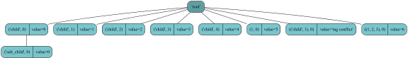

    Figure shows the tree with additional level in first item

For sure the deeper levels can be accessed via multiple `__getitem__()` too. But in case of multiple matches the
results can be very confusing.

Imagine in the first level you target a tag-family with multiple items the second index targets in this case
the items in the delivered level1 list only and does not dive in the tree as the user might expect:

.. start: tutorial-code 8_13

::
  
  >>> root[0][0] # access nested (deeper) items
  iTree('sub_child', value=0)
  >>> root['child'][0] # If the result of first operation is not a single item this will deliver the first item in the result-list
  iTree('child', value=0, subtree=[iTree('sub_child', value=0)])
  >>> # See that the result is in the first and not in the second level of the iTree!!
  

.. end - entry created: 2023-06-22T21:38:27

To avoid such failures it's recommended to use the more advanced in-depth get-methods.
E.g: usage of `get()`:

.. start: tutorial-code 8_14

::
  
  >>> root.get(0,0)
  iTree('sub_child', value=0)
  >>> root.get(0,('sub_child',0))  # access nested (deeper) items via target-path-list (mixed target types)
  iTree('sub_child', value=0)
  >>> target_path=[0,0]
  >>> root.get(*target_path) # targets deep
  iTree('sub_child', value=0)
  >>> root.get(*[0,0]) # targets deep -> single item arguments given will deliver single item only
  iTree('sub_child', value=0)
  >>> # be CAREFUL because:
  >>> root.get(*[0,0]) # gives empty list because target single item has no subtree (type cast to list)
  iTree('sub_child', value=0)
  >>> root.get(target_path) #target first level only (absolute index-list given)
  [iTree('child', value=0, subtree=[iTree('sub_child', value=0)]), iTree('child', value=0, subtree=[iTree('sub_child', value=0)])]
  >>> root.get([0,0]) #target first level only (absolute index-list given)
  [iTree('child', value=0, subtree=[iTree('sub_child', value=0)]), iTree('child', value=0, subtree=[iTree('sub_child', value=0)])]
  

.. end - entry created: 2023-06-22T21:38:27

The functionality of `get()` is to handle multiple results in higher levels and combine them in an internal iterator.
The result is at the end a flattended list that considers all findings in the **final** target level from all branches
that were matching.

In case one level only is given the method behaves like `__getitem__()` except that in case of issues a default
might be returned (if defined as named parameter).

The method `get.single()` enforces the delivery of unique items. The user can be sure that just a single
item will be delivered. In case of multi-target parameters given the method analysis the result and shrink a list
with a unique element to the element itself. If the list contains more items this is handled as no match
and a ValueError will be raised (or default value will be delivered if defined).

The method `get.iter()` delivers always an iterator over the items targeted. In case of unique findings
it delivers a list `[unique_item]` that is iterable and can be easy identified by a type check.

For the in-depth get-methods a level filter functionality is available. The user can define level filters
by giving filtering methods for the different levels (see :ref:`level-filtering <level_filtering>`).

.. start: tutorial-code 8_15

::
  
  >>> root.get(lambda i: i.value==0,lambda i: i.value==0) # level filtering
  [iTree('sub_child', value=0)]

.. end - entry created: 2023-06-22T21:38:27

***************************
Comparing iTrees
***************************

In case `iTree`-items should be compared the difference in between the `==` operator and
the `is` keyword
should be understood. An `ìTree` object is equal ( `==` ) if the following statement delivers `True` :

    >>> itree.tag and itree.data and all(sub_i==sub_o for sub_i,sub_o in zip(itree,other))
    True

To check if the item is really the same (instance) the user must use `is`.

.. autofunction:: itertree.iTree.__eq__()
            :noindex:

.. autofunction:: itertree.iTree.equal()
            :noindex:

.. autofunction:: itertree.iTree.__hash__()
            :noindex:

The explicit `equal()` method allows the check of additional properties (e.g. flags or the `itree.coupled_object` ),
which are not considered in the normal `__eq__()` method.

The difference inbetween `==` and `is` is also important in case of the `ìn` operation where the operation `==` is used.
Same for the `index()` and `deep.index()` method.  The `index()` function behaves here like in lists and the start parameter can be used
to target multiple searches.

To get the index of a specific item it is recommended just to use the `ìTree` property `itree.idx` or
`itree.idx_path` which delivers the absolute index/index-path of the specific item directly.

.. autoproperty:: itertree.iTree.idx()
            :noindex:

.. autoproperty:: itertree.iTree.idx_path()
            :noindex:

Methods checking if a item is a child of the `iTree`-object:

.. autofunction:: itertree.iTree.__contains__()
            :noindex:

.. function:: itertree.iTree.deep.__contains__()
coded in helper-class:

.. autofunction:: itertree.itree_indepth._iTreeIndepthTree.__contains__()
            :noindex:

.. autofunction:: itertree.iTree.is_in()
            :noindex:

.. function:: itertree.iTree.deep.is_in()
coded in helper-class:

.. autofunction:: itertree.itree_indepth._iTreeIndepthTree.is_in()
            :noindex:

.. autofunction:: itertree.iTree.index()
            :noindex:

.. function:: itertree.iTree.deep.index()
coded in helper-class:

.. autofunction:: itertree.itree_indepth._iTreeIndepthTree.index()
            :noindex:

.. autofunction:: itertree.iTree.count()
            :noindex:
.. function:: itertree.iTree.deep.count()
coded in helper-class:

.. autofunction:: itertree.itree_indepth._iTreeIndepthTree.count()
            :noindex:

.. autofunction:: itertree.iTree.is_tag_in()
            :noindex:

.. function:: itertree.iTree.deep.is_tag_in()
coded in helper-class:

.. autofunction:: itertree.itree_indepth._iTreeIndepthTree.is_tag_in()
            :noindex:

`iTree`s can also be compared with each other the criteria here is the size `__len__()` of the objects. Based on
this comparison operators `<` ; `<=` ; `>` ; `>=` are available. The methods exists in the level 1 children related
variant (base-class) or in in-depth variant (use `deep`-sub-class).

For length calculations the following methods exists:

.. autofunction:: itertree.iTree.__len__()
            :noindex:

.. function:: itertree.iTree.deep.__len__()
coded in helper-class:

.. autofunction:: itertree.itree_indepth._iTreeIndepthTree.__len__()
            :noindex:

.. autofunction:: itertree.iTree.filtered_len()
            :noindex:

.. function:: itertree.iTree.deep.filtered_len()
coded in helper-class:

.. autofunction:: itertree.itree_indepth._iTreeIndepthTree.filtered_len()
            :noindex:

***************************
iTree properties
***************************

As we will see later on some properties of the `iTree` object can be modified by the related methods.

The `iTree` object contains the following general properties:

.. autoproperty:: itertree.iTree.root
            :noindex:

.. autoproperty:: itertree.iTree.is_root
            :noindex:

.. autoproperty:: itertree.iTree.parent
            :noindex:

.. autoproperty:: itertree.iTree.pre_item
            :noindex:

.. autoproperty:: itertree.iTree.post_item
            :noindex:

.. autoproperty:: itertree.iTree.level
            :noindex:

.. autoproperty:: itertree.iTree.max_depth
            :noindex:

.. autoproperty:: itertree.iTree.is_tree_read_only
            :noindex:

.. autoproperty:: itertree.iTree.is_value_read_only
            :noindex:

.. autoproperty:: itertree.iTree.is_linked
            :noindex:

.. autoproperty:: itertree.iTree.is_link_root
            :noindex:

.. autoproperty:: itertree.iTree.is_link_cover
            :noindex:

.. autoproperty:: itertree.iTree.is_placeholder
            :noindex:

Item identification properties:

.. autoproperty:: itertree.iTree.idx
            :noindex:

.. autoproperty:: itertree.iTree.tag_idx
            :noindex:

.. autoproperty:: itertree.iTree.idx_path
            :noindex:

.. autoproperty:: itertree.iTree.tag_idx_path
            :noindex:

The following examples shows how some of the `iTree`-properties are read out.

.. start: tutorial-code 9_1

::
  
  >>> root = iTree('root', subtree=[iTree('child', 0), iTree((1, 2), 'tuple_child0'), iTree('child', 1), iTree('child', 2),iTree((1, 2), 'tuple_child1')])
  >>> root[0] += iTree('subchild')
  >>> root.render()
  iTree('root')
   > iTree('child', value=0)
   .  > iTree('subchild')
   > iTree((1, 2), value='tuple_child0')
   > iTree('child', value=1)
   > iTree('child', value=2)
   > iTree((1, 2), value='tuple_child1')
  >>> root[0][0].root
  iTree('root', subtree=[iTree('child', value=0, subtree=[iTree('subchild')]),...,iTree((1, 2), value='tuple_child1')])
  >>> root[0][0].idx
  0
  >>> root[0][0].tag_idx
  ('subchild', 0)
  >>> root[0][0].idx_path
  (0, 0)
  >>> root[0][0].tag_idx_path
  (('child', 0), ('subchild', 0))
  >>> root[1].value
  tuple_child0
  >>> root[1].tag_idx
  ((1, 2), 0)
  >>> root[-1].value
  tuple_child1
  >>> root[-1].tag_idx
  ((1, 2), 1)
  >>> len(root) #  level 1 only
  5
  >>> len(root.deep) # all in-depth items
  6
  >>> root2=root.copy()
  >>> root2[-1].append(iTree('subitem')) # we append one item in depth
  iTree('subitem')
  >>> root2>root # level 1 only size-compare
  False
  >>> root2.deep>root.deep # all items size-compare
  True

.. end - entry created: 2023-06-22T21:38:27

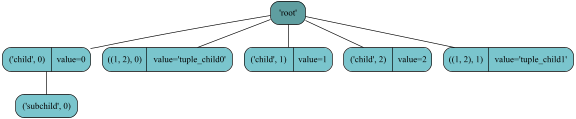

   Figure showing iTree used in example

As shown in the last example hashable objects can be used as tags for the itertree items to be stored in the `iTree`
object. Even for those kind of tag objects it is possible to store multiple items with the same tag.
In the example the enumeration inside the tag family can be seen in the index enumeration (tag_idx).

Beside those structural properties the `iTree` objects contains a property that can be used to "link" the ìTree`-object
to another Python object.

.. autoproperty:: itertree.iTree.coupled_object
            :noindex:

.. autofunction:: itertree.iTree.set_coupled_object()
            :noindex:

Different than the data the coupled_obj the idea is here to have just a pointer to another Python object. The only
operations considering those objects is in the link root were during reload or if a linked item is converted in a
local item the couple object will be taken over. The `equal()` compare function can also target the coupled-object.

.. note:: Behind this objects is the following idea:
          E.g. The user might couple the `iTree` to a graphical user interface object. Connect it with an
          item in a hypertree-list. Or it can be used to couple the `iTree` object to an item in a mapping dictionary.
          The property coupled-object is not actively managed by the `iTree` object it's just a place to store a pointer.
          E.g. If `iTree` is stored in a file or standard compares this information will not be considered.

There can be cases where it is helpful to use this additional possibility to store information in the `iTree` too. E.g.
in the attached calendar.example.py we use the coupled-object to store the day-name.

***************************
iTree value related methods
***************************

.. _value_access:

Compared with the previous versions (0.8.0) the handling of the data/value property is simplified a lot.

First we renamed the `data`-property to `value`-property to be compatible with the naming of items in dicts. Second we
came to the conclusion that the management of the value content is not the core function of `iTree` and so we
made it more independent as it was in the previous versions.

Now it is in the hand of the user if he stores a more complex object or e.g. just a simple integer
value in the `iTree`-object.

The old `iData`class is still available for downward compatibility. But the object is no more placed
automatically in the value of a ìTree` item. To utilize it the user must put the object manually in.
As explained we do not expect
anymore that the object stored in value is a dictionary like object (`iData`). We uncoupled here the
functionalities.

If required we can recommend one of the data-models available in the itertree package. They can be used to store
specific types of data (including checks). Other data models might be used too but the user must ensure that the
external data models
are serialized correctly if he wants to store the `iTree` and his data in files.

In case a `iTree` object is created without a `value` parameter the default value object
will be the `NoValue` class.

These are the value related methods available in `iTree`.

.. autoproperty:: itertree.iTree.value
            :noindex:

.. autofunction:: itertree.iTree.get_value()
            :noindex:

.. autofunction:: itertree.iTree.set_value()
            :noindex:

.. autofunction:: itertree.iTree.del_value()
            :noindex:

.. start: tutorial-code 12

::
  
  >>> my_tree = iTree('root')
  >>> my_tree.set_value(1)
  <class 'itertree.itree_helpers.NoValue'>
  >>> repr(my_tree.get_value())
  1
  >>> my_tree.set_value(Data.iTInt8Model())  # store a model limiting the matching values
  1
  >>> my_tree.set_value(1)  # store the value in the model
  <class 'itertree.itree_helpers.NoValue'>
  >>> repr(my_tree.value)  # delivers the whole object stored in value
  iTInt8Model(1)
  >>> repr(my_tree.get_value())  # again we take the value out of the model
  1
  >>> my_tree.set_value(1024)  # value out of the valid range
  Traceback (most recent call last):
  ...
  ValueError: Given value does not match to given filter_method (out of range)
  >>> repr(my_tree.del_value())  # delete the model
  iTInt8Model(1)
  >>> my_tree.value
  <class 'itertree.itree_helpers.NoValue'>

.. end - entry created: 2023-06-22T21:38:27

In case a `ìTValueModel` based object is stored in the `iTree`value the methods `get_value()` and `set_value()` will
not target the model itself. Furthermore the value inside the models will be read or exchanged.
If the model itself should be exchanged `set_value()` can be used too the method will automatically identify that
the new
value is a model and the old model will be replaced by the new one. Beside this the `del_value()`
targets always the value object and replaces it with `NoValue`. Even a model will be deleted in this case. To delete the
value in the model the user must use `get_value(NoValue)` or `my_tree.value.clear()`.

In addition to the normal get and set we have the key related methods for value access:

.. autofunction:: itertree.iTree.get_key_value()
            :noindex:

.. autofunction:: itertree.iTree.set_key_value()
            :noindex:

In general these methods behave like the normal counter part (model objects are handled the same way). The only
difference is that these methods targeting sub_values in `dict` or `list` like objects (using `__getitem__()`).
For `dict`s key is used like a key and for `list` key is used as an integer index. If the key does not exists
in a `dict`like object
the key-value pair will be added. For `list` an append via `INT=float('int')` as index is possible too. By default
for `list` like objects no matching indexes will raise an `IndexError` exception.

****************
iTree iterations
****************

As the name itertree suggests we have a lot of possibilities to iterate over the items in the tree-structure.
In the class the we use generators (`yield`-statement) to create the output for the iterations.

.. note:: The class doesn't contain a `__next__()`-method. This means if the given iteration methods are
          used (generators inside) the user must cast those generators for functions targeting
          the `__next__()` via the build-in `iter()`-statement. But most often this is not required
          because by most functionalities the supported `__iter__()` method is targeted.

In `iTree` we have iteration-generators which are more related to list-like functionalities and other
which are targeting more in the direction of the dict-like iterators.

Most iteration-generators are available in diffrent level behavior:

1. The children only variant iterating only over the items in level 1 of the tree-structure

2. In the in-depth variant which iterates as a flatten iterator over all the nested children.

First we show the list like standard iterator which delivers the children in the main/absolute order
of the `iTree`-object.

.. autofunction:: itertree.iTree.__iter__()
            :noindex:

The more dict-like iteration-methods targeting the children  (level 1) are:

.. autofunction:: itertree.iTree.keys()
            :noindex:

.. autofunction:: itertree.iTree.values()
            :noindex:

.. autofunction:: itertree.iTree.items()
            :noindex:

To make the delivered generator-content visible we use the `list()`-cast in the following examples:

.. start: tutorial-code 13_1

::
  
  >>> # create a small nested iTree:
  >>> root = iTree('root', subtree=[iTree('one', 1, subtree=[iTree('subone', 1.1), iTree('subtwo', 1.2)]), iTree('two', 2), iTree('three', 3)])
  >>> list(root)  # __iter__()
  [iTree('one', value=1, subtree=[iTree('subone', value=1.1), iTree('subtwo', value=1.2)]), iTree('two', value=2), iTree('three', value=3)]
  >>> list(root)
  [iTree('one', value=1, subtree=[iTree('subone', value=1.1), iTree('subtwo', value=1.2)]), iTree('two', value=2), iTree('three', value=3)]
  >>> list(root.values())
  [1, 2, 3]
  >>> list(root.tag_idxs())
  Traceback (most recent call last):
  ...
  AttributeError: 'iTree' object has no attribute 'tag_idxs'
  >>> list(root.items())
  [(('one', 0), iTree('one', value=1, subtree=[iTree('subone', value=1.1), iTree('subtwo', value=1.2)])), (('two', 0), iTree('two', value=2)), (('three', 0), iTree('three', value=3))]
  >>> list(root.items(values_only=True))
  [(('one', 0), 1), (('two', 0), 2), (('three', 0), 3)]
  

.. end - entry created: 2023-06-22T21:38:27

We have some special iteration-methods related to the item access based on the groups created by tag-families.
The delivered items are ordered by the first item (or the last - if parameter is set) in the family and the iteration
runs over all items of the first familly then all items of the next and so on.

.. autofunction:: itertree.iTree.tags()
            :noindex:

.. autofunction:: itertree.iTree.iter_families()
            :noindex:

.. autofunction:: itertree.iTree.iter_family_items()
            :noindex:

.. note:: The family structure inside `iTree` cannot be made available directly because this would
          give the user the possibility of corrupting manipulations. But the user can use those family related iteration
          functions if he wants to create a representation of the family structure.

Most in-depth iteration-methods have additional parameters:

   * `filter_method` filter parameter which allows
     the hierarchical-filtering inside the iteration loops.

   * `up_to_low` allows to select the
     direction of the iteration top->down or bottom-> up (default: `up_to_low=True`).

All the in-depth iteration-methods are reached via the helper class `iTree.deep`:

.. function:: itertree.iTree.deep.__iter__()
coded in helper-class:

.. autofunction:: itertree.itree_indepth._iTreeIndepthTree.__iter__()
            :noindex:

.. function:: itertree.iTree.deep.iter()
coded in helper-class:

.. autofunction:: itertree.itree_indepth._iTreeIndepthTree.iter()
            :noindex:

As explained we can iter in two directions up-> low (default) or low->up (set parameter `up_to_low=False`):

.. start: tutorial-code 20

::
  
  >>> root = iTree('root') 
  >>> for i in range(2):
      item=root.append(iTree('%i'%i, i))
      for ii in range(2):
          subitem = item.append(iTree('%i_%i' % (i,ii), i*10+ii))
          for iii in range(2):
              subitem.append(iTree('%i_%i_%i' % (i, ii,iii), i * 100 + ii*10+iii))
  >>> [i for i in root.deep.iter(up_to_low=True)][0:5] # show just a part
  [iTree('0', value=0, subtree=[iTree('0_0', value=0, subtree=[iTree('0_0_0', value=0), iTree('0_0_1', value=1)]), iTree('0_1', value=1, subtree=[iTree('0_1_0', value=10), iTree('0_1_1', value=11)])]), iTree('0_0', value=0, subtree=[iTree('0_0_0', value=0), iTree('0_0_1', value=1)]), iTree('0_0_0', value=0), iTree('0_0_1', value=1), iTree('0_1', value=1, subtree=[iTree('0_1_0', value=10), iTree('0_1_1', value=11)])]
  >>> [i for i in root.deep.iter(up_to_low=False)][0:5] # show just a part
  [iTree('0_0_0', value=0), iTree('0_0_1', value=1), iTree('0_0', value=0, subtree=[iTree('0_0_0', value=0), iTree('0_0_1', value=1)]), iTree('0_1_0', value=10), iTree('0_1_1', value=11)]

.. end - entry created: 2023-06-22T21:38:27

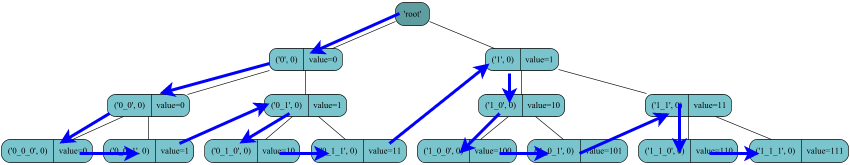

   Figure schema for up->down (default) iteration

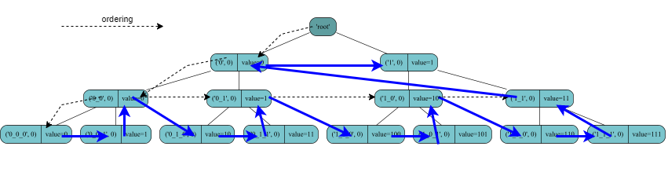

   Figure schema for down->up iteration

Additional we have the in-depth iteration-methods:

.. function:: itertree.iTree.deep.idx_paths()
coded in helper-class:

.. autofunction:: itertree.itree_indepth._iTreeIndepthTree.idx_paths()
            :noindex:

.. function:: itertree.iTree.deep.tag_idx_paths()
coded in helper-class:

.. autofunction:: itertree.itree_indepth._iTreeIndepthTree.tag_idx_paths()
            :noindex:

.. function:: itertree.iTree.deep.iter_family_items()
coded in helper-class:

.. autofunction:: itertree.itree_indepth._iTreeIndepthTree.iter_family_items()
            :noindex:

Related to tag_family sorted iterations we have in-depth only the `ìter_family_items()` mathod available.

In the following example we create based on the in-depth generators lists and dicts:

.. start: tutorial-code 13_2

::
  
  >>> # deep iterators:
  >>> list(root.deep)  # deep counterpart of level1 __iter__() iterator
  [iTree('one', value=1, subtree=[iTree('subone', value=1.1), iTree('subtwo', value=1.2)]), iTree('subone', value=1.1), iTree('subtwo', value=1.2), iTree('two', value=2), iTree('three', value=3)]
  >>> list(root.deep.iter(up_to_low=False))  # changed iteration order bottom-> up
  [iTree('subone', value=1.1), iTree('subtwo', value=1.2), iTree('one', value=1, subtree=[iTree('subone', value=1.1), iTree('subtwo', value=1.2)]), iTree('two', value=2), iTree('three', value=3)]
  >>> list(root.deep.tag_idx_paths()) # deep counterpart of level1 items() iterator
  [((('one', 0),), iTree('one', value=1, subtree=[iTree('subone', value=1.1), iTree('subtwo', value=1.2)])), ((('one', 0), ('subone', 0)), iTree('subone', value=1.1)), ((('one', 0), ('subtwo', 0)), iTree('subtwo', value=1.2)), ((('two', 0),), iTree('two', value=2)), ((('three', 0),), iTree('three', value=3))]
  >>> [(k,i.value) for k,i in root.deep.tag_idx_paths()]  # deep counterpart of level1 items(values_only=True) iterator
  [((('one', 0),), 1), ((('one', 0), ('subone', 0)), 1.1), ((('one', 0), ('subtwo', 0)), 1.2), ((('two', 0),), 2), ((('three', 0),), 3)]
  >>> [k for k,_ in root.deep.tag_idx_paths()]  # deep counterpart level1 to keys() iterator
  [(('one', 0),), (('one', 0), ('subone', 0)), (('one', 0), ('subtwo', 0)), (('two', 0),), (('three', 0),)]
  >>> [k for k,_ in root.deep.idx_paths()]  # no level 1 counterpart (lists are automatically indexed 0->n)
  [(0,), (0, 0), (0, 1), (1,), (2,)]

.. end - entry created: 2023-06-22T21:38:27

********************
iTree Filter Queries
********************

.. _filter_method:

A lot of the in-depth methods contain the parameter `filter_method` that can be used for hierarchical inside
filtering of `iTree`-items. For non-hierarchical filtering the user can use the build-in `filter()`-method.
In case an outside filtering is not possible (`filter()` cannot be used) the methods
have an additional parameter `hierarchical` to switch in between the two ways of filtering.

As `filter_method` the user can give a callable object that analysis the given item and calculates if the
item matches to the specific criteria and deliver a True/False (match/no match) for the item.

The `iTree`-class contains no more the old `find()`and `find_all()` methods because all searches can be realized easier
and more clear via the `filter_method`-parameter.

Also we do not have any more a special ´iTFilter`-class, we decided that normal filtering via filtering
methods is more practicable. As a help for the user we still provide some filter classes/methods under `itertree.itree_filters`
that might help related to the filtering of `iTree` specifics.

.. start: tutorial-code 14

::
  
  >>> root = iTree('root', subtree=[iTree('one', 1, subtree=[iTree('subone', 1.1), iTree('subtwo', 1.2)]), iTree('two', 2), iTree('three', 3)])
  >>> filter1 = lambda i: 'one' not in i.tag
  >>> list(root.deep.tag_idx_paths(filter1))
  [((('two', 0),), iTree('two', value=2)), ((('three', 0),), iTree('three', value=3))]
  >>> # the hierarchical filter did not consider the item iTree('subtwo',1.2) because parent is filtered out
  >>> list(filter(lambda i: 'one' not in i[1].tag, root.deep.tag_idx_paths())) # for non-hierachical filtering use build-in
  [((('one', 0), ('subtwo', 0)), iTree('subtwo', value=1.2)), ((('two', 0),), iTree('two', value=2)), ((('three', 0),), iTree('three', value=3))]
  >>> # now the sub-items are considered even that parent did not match
  

.. end - entry created: 2023-06-22T21:38:27

.. _level_filtering:

A very special filtering can be realized in the `get()`-method by putting filters in the related levels
of a target_path (level filter).

E.g.:

::

    root.get(Filters.is_item_tag('mytag'),Filters.is_item_tag('mytag2'))

will filter in first level for all items with the tag 'mytag' and in next level for all items with the tag 'mytag2'.

The filter is used only at the specific level (in side one level we can just filter) but in the next level only the
findings of first level will be considered. Therefore the level filtering is a hierarchical filtering which means only
the matching items of the previous level are considered in the next level..

.. start: tutorial-code 14

::

    >>> # based on the root object we had in last example
    >>> filter_a = lambda i: 'one' in i.tag  # This will filter for the first two elements
    >>> filter_b = lambda i: i.value == 1.2  # First element doesn't have this level (no match)
    >>> root.get(*[filter_a, filter_b]) # level filtering level=0~filter_a; level=1~filter_b
    [iTree('subtwo', value=1.2)]

.. end

The filtering in `iTree` is very effective and quick. As an example one might execute the example script
itree_usage_example1.py or calendar_example.py. It's recommended that the user uses
iterator related functions to reach the expected results (e.g. see itertools package).

*****************************************************
iTree full overview over the in-depth functionalities
*****************************************************

We already
talked about some of the features in the in previous chapters (access and iterators) but now we like to give a full
overview about in-depth
related functionalities.

All related methods are available in a specific `iTree`-object via the subclass `itree.deep`.

.. autofunction::itertree.itree_indepth._iTreeIndepthTree.unset_tree_read_only()
            :noindex:

.. autofunction::itertree.itree_indepth._iTreeIndepthTree.unset_value_read_only()
            :noindex:

.. autofunction::itertree.itree_indepth._iTreeIndepthTree.set_value_read_only()
            :noindex:

.. autofunction::itertree.itree_indepth._iTreeIndepthTree.__len__()
            :noindex:

.. autofunction::itertree.itree_indepth._iTreeIndepthTree.__lt__()
            :noindex:

.. autofunction::itertree.itree_indepth._iTreeIndepthTree.__le__()
            :noindex:

.. autofunction::itertree.itree_indepth._iTreeIndepthTree.__gt__()
            :noindex:

.. autofunction::itertree.itree_indepth._iTreeIndepthTree.__ge__()
            :noindex:

.. autofunction::itertree.itree_indepth._iTreeIndepthTree.count()
            :noindex:

.. autofunction::itertree.itree_indepth._iTreeIndepthTree.filtered_len()
            :noindex:

.. autofunction::itertree.itree_indepth._iTreeIndepthTree.__contains__()
            :noindex:

.. autofunction::itertree.itree_indepth._iTreeIndepthTree.is_in()
            :noindex:

.. autofunction::itertree.itree_indepth._iTreeIndepthTree.is_tag_in()
            :noindex:

.. autofunction::itertree.itree_indepth._iTreeIndepthTree.index()
            :noindex:

.. autofunction::itertree.itree_indepth._iTreeIndepthTree.reverse()
            :noindex:

.. autofunction::itertree.itree_indepth._iTreeIndepthTree.sort()
            :noindex:

.. autofunction::itertree.itree_indepth._iTreeIndepthTree.remove()
            :noindex:

.. autofunction::itertree.itree_indepth._iTreeIndepthTree.__iter__()
            :noindex:

.. autofunction::itertree.itree_indepth._iTreeIndepthTree.iter()
            :noindex:

.. autofunction::itertree.itree_indepth._iTreeIndepthTree.idx_paths()
            :noindex:

.. autofunction::itertree.itree_indepth._iTreeIndepthTree.tag_idx_paths()
            :noindex:

**********************************
iTree formatted output and storage
**********************************

The `iTree`-object can be printed out via classical `repr()` or `str()` method, the second method delivers a
shorten representation of the subtree.

.. autofunction:: itertree.iTree.__repr__()
            :noindex:

.. autofunction:: itertree.iTree.__str__()
            :noindex:

A formatted multi-line tree output is available too. If the parameter `enumerate` is set the items in
the printed tree are also enumerated by the absolute index.

.. autofunction:: itertree.iTree.renders()
            :noindex:

.. autofunction:: itertree.iTree.render()
            :noindex:

(The renderer in Version 1.0.0 was improved and uses
now ascii-only characters and delivers a smaller footprint).

For full serialization of the `iTree`-objects it's recommended to use the
internal `dumps()` method. If the internal methods are used (file storage is possible too) the result is
represented and stored as a JSON artifact.

.. autofunction:: itertree.iTree.dumps()
            :noindex:

.. autofunction:: itertree.iTree.loads()
            :noindex:

.. autofunction:: itertree.iTree.dump()
            :noindex:

.. autofunction:: itertree.iTree.load()
            :noindex:

In the methods the serializer can be set and might be replaced by the users own serializing format.

The serializer for Version 1.0.0 is modified and the output format is not
compatible with the old format version 1.1.1. New format can be created quicker and it has no more issues with
recursion depth exceptions. The conversion of old files can be made via the helper script:

::

    >>> from itertree.itree_serializer.itree_json_converter import Converter_1_1_1_to_2_0_0
    >>> new_itree=Converter_1_1_1_to_2_0_0(old_source_file_path)

The new storage format was required because in Version 1.0.0 we now have only one iTree class that uses
the flags parameter to be switched to read-only where we used a special class in the old implementation.

But beside this we wanted to have a better performance related to the serializing of the objects. We think that the
readability is improved too. Even that this was not the main target. The new format is also 100% JSON compatible and
can be read in by any JSON parser.

The output looks like this:

::

    [
    {
      "TYPE": "itertree.iTree",
      "VERSION": "2.0.0"
      "HASH": "e7891f95dd2f2c85d4383a8772a317e11363c495dc65a278c821836846d06471",
    },
    [
    [0,0,["root",0],[0,8]],
      [1,0,["0",0],[0,8]],
        [2,0,["0_0",0],[0,8]],
          [3,0,["0_1",0],[0,8]],
            [4,0,["0_2",0],[0,8]],
              [5,0,["0_3",0],[0,8]],
    ]]

After the well readable header the user can see that the tree is stored in a flat list structure (which avoids
RecursionError exceptions in the JSON parsers).

The formatting of the
output is created in a way that each iTree item has its own row and the indentation-level gives the hint about
the level in the tree. Each item is coded in JSON in the following way:

`[level,family-idx,[tag-value,type-code],[value-value,type-code]]`

In case the item has additional parameters they are coded like the tag and the value too. The family-index
is only given for better readability of the files, it's not used during the reconstruction of the object.

We have also a dot generator available which may help to create a graphical representation of the tree but this is
not deeply
tested there might be limits and we cannot ensure that the shown order is always correct.

Related to serialization we like to remark that `iTree`-objects can be pickled (`pickle(my_tree)`).

***************************
iTree linked sub-trees
***************************

The `iTree` objects can be merged to one main tree from different source files by using the `link` parameter.
The result is a merged `iTree` that contains all the linked subtrees.
Beside the linking from different files links inside a `iTree` structure (internal links) can be defined too.

The value of the `link` parameter of the `iTree`-class must be an `iTLink`object which defines the
`file_path` and the `target_path`. The parameters
are dependent. For links inside the same `iTree` the `file_path` must be set to `None`. For links targeting
the root of a file the `target_path` parameter must be set to `None`.
The `target_path` must target a unique item in the source-tree!

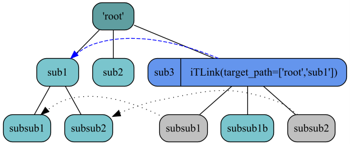

   Figure showing how "sub3" links to "sub1" item and "inherits" it's subitems beside the local ones

Additionally the user can manipulate the linked items by making them local (covering) or by appending local items.
The functionalities given here are limited to operations that do not imply a reordering of the items in the
tree. The reason for this is that the linked items cannot be reordered furthermore
they gave the tree a fixed, static structure.  E.g. mainly we have `append()` and `make_local()`
functions and we cannot `appendleft()` or `insert()` because this would mean we have to
reorder the other items. A change of a linked structure can only be made by manipulating the original
source structure. We allow only the localization of items that are a child of the linked root item,
in deeper levels this is not possible.

The local items in a linked `iTree` are integrated in the tree during the load process of the
linked items. The identification is always made via the key (family-tag,family-index) of the item.
The local storage of the tree contains iTree items that are merged as placeholders which will be replaced
by the linked in items during the load process. Those placeholders are needed to create the matching key
for the real items that should be kept after reload. In case the loaded structure is changed and and no
matching item is found the placeHolder-items will remain in the `iTree`. All appended local items which
are outside of the linked structure will be always positioned at the end of the tree.

Local items can be manipulated as normal `iTree` items with one exception. In case a local item is
deleted and a matching linked item is available (was covered by the local item) the linked item
will replace the local item after deletion. This means in this case a delete of an item will not
reduce the numbers of the items. If the local item has no corresponding linked item the number of
children will decrease as usual.

The linked items must be loaded and updated by an explicit operation. They are not loaded automatically.
For this the method `load_links()` is used. The method can be executed at any level of the tree and
it will start loading all links in the related subtree (use `load_links()`). By this mechanism incremental
loads are possible. If the user wants to be sure that all linked items are loaded he must use the method in the
root-object of the tree (load all links).

The behavior in case of load erros can be switched between Exceptions or deleting
invalid items (via the `delete_invalid_items` parameter of the `load_links()`-method). In case of exceptions
the `iTree` might be in an incomplete load state and if the exception is kept by the user this situation must
be must be handled somehow
(e.g. copy original tree before loading and replace back). The automated loading `iTree` links during instance
of the object can
be influenced via the `flags=iTFLAG.LOAD_LINKS` parameter that will activate the loading during instance.

.. warning:: The user must be aware that changing the source structure and local items in parallel might
             lead to unexpected results. **The identification of local items is always done via the
             key (family-tag,family-index)**. If we miss items during load placeholders are
             used to keep the key of the "real" local items. Normally those artefacts will be
             replaced during the load with the "real" linked items (if found) but in case of
             mismatches they will stay in the tree. Using wild linking in between different `iTree`
             items can lead into very confusing situations especially if the user removes local items.
             We recommend to use the feature only in special cases where the source architecture is clearly
             defined and remains structural relative stable. For stability reasons we have also functional
             limitations in linked iTree objects (e.g. we do allow only linking on not already linked
             items (protection for circular definitions); local items can never be linked items.

.. autofunction:: itertree.itree_main.iTree.load_links()
            :noindex:

.. autoproperty:: itertree.itree_main.iTree.is_linked
            :noindex:

.. autoproperty:: itertree.itree_main.iTree.is_link_root
            :noindex:

.. autoproperty:: itertree.itree_main.iTree.is_link_loaded
            :noindex:

.. autoproperty:: itertree.itree_main.iTree.is_placeholder
            :noindex:

Beside this the following specific functions are available on linked items:

.. autofunction:: itertree.itree_main.iTree.make_local()
            :noindex:

For a better understanding please have a look in the example file examples/itree_link_example1.py in the package.
That contains the following examples too.

Special functionalities related to linking of iTrees:

To link a subtree in an `iTree`-object the link=iTLink(file_path,target_path) is defined when
the object is instanced. A link cannot be added later on to the object.

.. start: tutorial-code 16_1

::
  
  >>> # We create a small iTree:
  >>> root = iTree('root')
  >>> root += iTree('A')
  >>> root += iTree('B')
  >>> B = iTree('B')
  >>> B += iTree('Ba')
  >>> # we create multiple 'Bb' elements to show how the placeholders are used during save and load
  >>> B += iTree('Bb')
  >>> B += iTree('Bb')
  >>> B += iTree('Bc')
  >>> root += B
  >>> # !! Now we create a internal link (but we disable the loading (no flag set))):
  >>> # (internal link -> iTLink(file_path==None,target_path= item identification) (target_path like in get_deep())
  >>> linked_element = iTree('internal_link', link=iTLink(target_path=[('B', 1)]))
  >>> root.append(linked_element)
  iTree('internal_link', link=iTLink(None,[('B', 1)]), flags=0b100000)
  >>> root.render()
  iTree('root')
   > iTree('A')
   > iTree('B')
   > iTree('B')
   .  > iTree('Ba')
   .  > iTree('Bb')
   .  > iTree('Bb')
   .  > iTree('Bc')
   > iTree('internal_link', link=iTLink(None,[('B', 1)]), flags=0b100000)
  >>> root.load_links() # now we load the linked items
  True
  >>> root.render()  # The tree renderer marks linked items with ">>"
  iTree('root')
   > iTree('A')
   > iTree('B')
   > iTree('B')
   .  > iTree('Ba')
   .  > iTree('Bb')
   .  > iTree('Bb')
   .  > iTree('Bc')
   > iTree('internal_link', link=iTLink(None,[('B', 1)]), flags=0b100100)
   .  >>iTree('Ba')
   .  >>iTree('Bb')
   .  >>iTree('Bb')
   .  >>iTree('Bc')
  

.. end - entry created: 2023-06-22T21:38:27

As shown in the example the internal linked item contains now the same subtree as the item ("B",1). But they
are integrated as linked iTree objects which protects the items from changes (readonly). If we change the
items in the "B" item the changes are only considered if we reload the links in the tree!

.. start: tutorial-code 16_2

::
  
  >>> root['B', 1] += iTree('B_post_append')
  >>> root.render()
  iTree('root')
   > iTree('A')
   > iTree('B')
   > iTree('B')
   .  > iTree('Ba')
   .  > iTree('Bb')
   .  > iTree('Bb')
   .  > iTree('Bc')
   .  > iTree('B_post_append')
   > iTree('internal_link', link=iTLink(None,[('B', 1)]), flags=0b100100)
   .  >>iTree('Ba')
   .  >>iTree('Bb')
   .  >>iTree('Bb')
   .  >>iTree('Bc')
  >>> root.load_links()  # The returning True signalizes that the tree was reloaded
  True
  >>> root.render()
  iTree('root')
   > iTree('A')
   > iTree('B')
   > iTree('B')
   .  > iTree('Ba')
   .  > iTree('Bb')
   .  > iTree('Bb')
   .  > iTree('Bc')
   .  > iTree('B_post_append')
   > iTree('internal_link', link=iTLink(None,[('B', 1)]), flags=0b100100)
   .  >>iTree('Ba')
   .  >>iTree('Bb')
   .  >>iTree('Bb')
   .  >>iTree('Bc')
   .  >>iTree('B_post_append')
  >>> root.load_links()  # If we repeat the action the command detects that the tree is  unchanged and no update is needed
  False
  >>> root.load_links(force=True)  # Anyway the update can be forced
  True
  

.. end - entry created: 2023-06-22T21:38:27

The toplevel linked `iTree`-object allow some manipulations of the subtree. We can append items and we can convert the
linked sub-items into  local-items that covers the linked item and that can contain different values
and a different subtree. But we cannot change the order of the linked items! Therefore the commands like `insert()`
or `append_left()` are not allowed.

.. start: tutorial-code 16_3

::
  
  >>> intern_link_item = root['internal_link', 0]  # get the linked item
  >>> intern_link_item.append('new')  # append a local item
  iTree(value='new')
  >>> local = intern_link_item[2].make_local()  # make a linked item local (cover the item with a local one)
  >>> local.append(iTree('sublocal'))  # we change the subtree of the local item
  iTree('sublocal')
  >>> local.set_value('myvalue')  # we change the value of the local item
  <class 'itertree.itree_helpers.NoValue'>
  >>> root.render()  # see that in the linked tree we have local elements (linked items are marked with ">>")
  iTree('root')
   > iTree('A')
   > iTree('B')
   > iTree('B')
   .  > iTree('Ba')
   .  > iTree('Bb')
   .  > iTree('Bb')
   .  > iTree('Bc')
   .  > iTree('B_post_append')
   > iTree('internal_link', link=iTLink(None,[('B', 1)]), flags=0b100100)
   .  >>iTree('Ba')
   .  >>iTree('Bb')
   .  > iTree('Bb', value='myvalue')
   .  .  > iTree('sublocal')
   .  >>iTree('Bc')
   .  >>iTree('B_post_append')
   .  > iTree(value='new')
  

.. end - entry created: 2023-06-22T21:38:27

The item 'Bb' in the linked subtree is now no more an iTreeLink object, its a normal `iTree` object. The identification of the covering item is internally always done via the TagIdx of the item. We can do all `iTree` related operations on this object. But there is one exception: if we delete the object the linked object will come back into the tree!

.. start: tutorial-code 16_4

::
  
  >>> del intern_link_item[('Bb', 1)]
  >>> print(root.render())
  iTree('root')
   > iTree('A')
   > iTree('B')
   > iTree('B')
   .  > iTree('Ba')
   .  > iTree('Bb')
   .  > iTree('Bb')
   .  > iTree('Bc')
   .  > iTree('B_post_append')
   > iTree('internal_link', link=iTLink(None,[('B', 1)]), flags=0b100100)
   .  >>iTree('Ba')
   .  >>iTree('Bb')
   .  >>iTree('Bb')
   .  >>iTree('Bc')
   .  >>iTree('B_post_append')
   .  > iTree(value='new')
  None

.. end - entry created: 2023-06-22T21:38:27

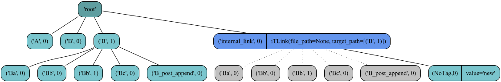

The link functionality in iTrees can be understood like the overloading mechanism of classes. By linking a subtree in
the tree this is like defining a superclass for a specific tree section. By making a subitem local this part
of the linked `iTree` is covered (overloaded). But we should not stress this analogy to much because the
functionalities in this covered data structures are much less then we have it in the class concept.

There are some quite difficult to understand aspects related to the linking of items. The ordering of loading the
linked items and the mixing with the local items might be confusing. Especially if the user stores such `iTree`-objects
in files and when the source is manipulated. The main order is always given by the linked elements and there keys
(tag-idx-pairs). A not loaded but linked tree contains all local elements and placeholder items that mark where
in the linked tree the local elements should be placed in. From the concept the local items where no linked
counterpart is found will be always placed before the next linked local item (if it's a "real" one or a placeholder).
All not filled local items will appended at the end during the `load_links()` process.

The most confusing things may happen if the user re orders the link source in a way that elements from the end
are moved to the beginning. Original load scheme:

.. list-table::

 * - **locals**
   - **linked**
   - **result**
 * - |
   - | iTree('link0')
   - | iTree('link0')
 * - | iTree('tag1')
   - |
   - | iTree('tag1')
 * - | iTree('tag2',value='new_value')
   - | *iTree('tag2',value='link_value)*
   - | iTree('tag2',value='new_value')
 * - | iTree('tag4')
   - |
   - | iTree('tag4')
 * - | iTree('tag5',value='new_value')
   - | *iTree('tag5',value='link_value)*
   - | iTree('tag5',value='new_value')
 * - | iTree('tag6')
   - |
   - | iTree('tag6')

Lets change the order of the source in the following way:

::

    >>>root[('tag5',0)].move(('tag2',0))

After `load_links()` we will find the following situation

.. list-table::

 * - **locals**
   - **linked**
   - **result**
 * - |
   - | iTree('link0')
   - | iTree('link0')
 * - | iTree('tag4')
   - |
   - | iTree('tag4')
 * - | iTree('tag5',value='new_value')
   - | *iTree('tag5',value='link_value)*
   - | iTree('tag5',value='new_value')
 * - | iTree('tag1')
   - |
   - | iTree('tag1')
 * - | iTree('tag2',value='new_value')
   - | *iTree('tag2',value='link_value)*
   - | iTree('tag2',value='new_value')
 * - | iTree('tag6')
   - |
   - | iTree('tag6')

In the linked source the *cursive* items have changed their position and the connected local items follow them.

The user might understand that the linked structure and order is somehow the main principle of ordering and
the local items
always follow this structure. So after the source is reordered the local items are reordered too. The local items that
have no counterpart following always the anchor element afterwards (The item with 'tag4' is glued to 'tag5 and the
item with 'tag1' is glued with 'tag2').

***************************************
iTree - extensions
***************************************

The itertree-package contains some extensions especially related to the build of data models which
can be optionally used to determine the data stored in the `iTree`-value attribute.

.. _helper_filters:

Predefined Filters
++++++++++++++++++

As a help for filtering on `iTree`-objects the user can find the following predefined filter classes/methods
under `itertree.itree_filters` :

.. autofunction:: itertree.itree_filters.has_item_flags()

.. autofunction:: itertree.itree_filters.is_item_tag()

.. autofunction:: itertree.itree_filters.has_item_tag_fnmatch()

.. autofunction:: itertree.itree_filters.has_item_value()

.. autofunction:: itertree.itree_filters.has_item_value_dict_value()

.. autofunction:: itertree.itree_filters.has_item_value_list_value()

.. autofunction:: itertree.itree_filters.has_item_value_fnmatch()

.. autofunction:: itertree.itree_filters.has_item_value_dict_value_fnmatch()

.. autofunction:: itertree.itree_filters.has_item_value_list_item_fnmatch()

.. autofunction:: itertree.itree_filters.is_item_value_in()

.. autofunction:: itertree.itree_filters.has_item_value_dict_value()

.. autofunction:: itertree.itree_filters.has_item_value_list_value()

.. autofunction:: itertree.itree_filters.has_item_value_dict_key()

.. autofunction:: itertree.itree_filters.has_item_value_list_idx()

.. autofunction:: itertree.itree_filters.has_item_value_dict_key_fnmatch()

.. autofunction:: itertree.itree_filters.has_item_value_dict_key_in()

Data Models
+++++++++++

To control the data that can, be stored in an `iTree`-object value attribute (see  :ref:`iTree value related methods`_)
the itertree package contains some
special classes related to the definition of data-models. Those models determine what kind of object can be
stored inside the model. For this the user can define the target data-type, range-conditions, etc.
Even the output formatting for string representations can be defined in those models.

The models might be useful and can be adapted by the user. But it's just an optional feature this is not related to the
core functionality of itertree. The `iTree`-class can be used independent from this.

The main class for model definition can be found via the "Data" extension of itertree.

.. autofunction:: itertree.Data.iTValueModel()

To give the user an idea how this class might be used and for practical proposes we already
defined a set of value models for typical data types:

.. autofunction:: itertree.Data.iTAnyValueModel()
    :noindex:

.. autofunction:: itertree.Data.iTRoundIntModel
    :noindex:

.. autofunction:: itertree.Data.iTIntModel()
    :noindex:

.. autofunction:: itertree.Data.iTInt8Model()
    :noindex:

.. autofunction:: itertree.Data.iTUInt8Model()
    :noindex:

.. autofunction:: itertree.Data.iTInt16Model()
    :noindex:

.. autofunction:: itertree.Data.iTUInt16Model()
    :noindex:

.. autofunction:: itertree.Data.iTInt32Model()
    :noindex:

.. autofunction:: itertree.Data.iTUInt32Model()
    :noindex:

.. autofunction:: itertree.Data.iTInt64Model()
    :noindex:

.. autofunction:: itertree.Data.iTUInt64Model()
    :noindex:

.. autofunction:: itertree.Data.iTFloatModel()
    :noindex:

.. autofunction:: itertree.Data.iTStrFnPatternModel()
    :noindex:

.. autofunction:: itertree.Data.iTStrRegexPatternModel()
    :noindex:

.. autofunction:: itertree.Data.iTASCIIStrModel()
    :noindex:

.. autofunction:: itertree.Data.iTUTF8StrModel()
    :noindex:

.. autofunction:: itertree.Data.iTUTF16StrModel()
    :noindex:

Mathsets extension
++++++++++++++++++

The itree package contains a extension we named mathsets which are a special kind of sets that can be used
for range definitions in data-models but also for filtering a specific content.

The main check method for those kind of objects is the `__contains__`-method which is target via the build-in `in`
statement.

The mathsets are a fragment of a new package that might be published in the future. The idea is mainly to extend
the Python `set()` in a more mathematical way by adding for example interval sets and by allowing the user
to define those sets by giving a mathematical definition string.

Therefore those classes might be interesting for the user independent from the usage related to `iTree`-objects.
Especially the class `mSetInterval` is a full representation of a mathematical interval which allows also
mathematical based object definitions like: `"{x| x e Z, -128<=x<128}"`

In itertree we have two main classes of mSets available:

.. autofunction:: itertree.itree_mathsets.mSetInterval()

.. autofunction:: itertree.itree_mathsets.mSetRoster()

Additional we have a helper classes that allows to combine those mathsets with each other or other objects
(like normal Python sets).

.. autofunction:: itertree.itree_mathsets.mSetCombine()

These for classes are targeting numerical set definitions (Intervals, RosterSets, numerical domains).
see https://en.wikipedia.org/wiki/Set_(mathematics) and https://en.wikipedia.org/wiki/Interval_(mathematics).

After we have presented the available classes we should give an idea of the usage. What might be the use case for this?
In an application we might have the following needs:

    1. We must create for the usage of the application a complex configuration
    2. The configuration should be structure in a tree
    3. The user should be capable to edit the value content of the attributes stored in the tree
    4. The app should check if the given values are valid for the targeted attribute
    5. The configuration should be shown in a GUI with a string representation
    6. Some attributes contains range definition for tolerances
    7. The user should be capable to define those tolerances with the help of mathematical descriptions

The most challenging attribute is in this case a tolerance definition that can be given by the user. Exactly for this
case the mathset functionalities are very helpful.

iData
+++++++++

The "old" `iData`-class which was used as standard data-structure in `iTree`-objects in older versions is still
available but must be added manually to the `iTree` as value object.

The object is in practice a dict-like structure which helps to manage the stored data values. But we would recommend
to use normal dictionaries with data models in the items as a replacement.

****************************************************
Comparison of the iTree object with lists and dicts
****************************************************

In first case the `iTree` behaves like a `list`. Therefore all `list` related
operations are supported in `iTree`-objects. Additionally in `iTree` we have the `dict` specific
key related operations available too.

The following table compares the behaviors (x is always the related object)

.. list-table::

 * - **Operation**
   - **iTree**
   - **list**
   - **dict**
 * - append
   - | x.append(item)
   - | x.append(item)
   - | x[new_key]=item
 * - appendleft
   - | x.appendleft(item)
   - | x.insert(0,item)
   - | n.a.
 * - | append by +=
   - | x+=item
   - | x+=item
   - | n.a.
 * - | extend
   - | x.extend(items)
   - | x.extend(items)
   - | n.a. - x.update(items)
     | goes in same direction
     | -> (overwrites existing keys)
 * - | extendleft
   - | x.extendleft(items)
   - | n.a. - you migth change
     | the target/source you are extending
     | and use normal extend
   - | n.a. - x.update(items)
     | goes in same direction
     | -> (overwrites existing keys)
 * - | insert
   - | x.insert(target,item)
   - | x.insert(index,item)
   - | n.a.
 * - | delete
   - | del x[target]
   - | del x[index]
   - | del x[key]
 * - | pop specific
   - | x.pop(target)
   - | x.pop(index)
   - | x.pop(key)
 * - | pop last
   - | x.pop() or x.pop(-1)
   - | x.pop(-1)
   - | x.popitem()
 * - | pop first
   - | x.popleft() or x.pop(0)
   - | x.pop(0)
   - | n.a
 * - | remove
   - | x.remove(value)
   - | x.remove(value)
   - | n.a.
 * - | move **
   - | x[target1].move(,target2)
   - | n.a.
   - | n.a.
 * - | reorder
   - | x[target1],x[target2],x[target3]= \\
     | x[target2],x[target3],x[target1]
   - | x[index1],x[index2],x[index3]= \\
     | x[index2],x[index3],x[index1]
   - | x[key1],x[key2],x[key3]= \\
     | x[key2],x[key3],x[key1]
 * - | reorder by slices
   - | x[target1:target3]= \\
     | x[target2],x[target3],x[target1]
   - | x[index1:index3]= \\
     | x[index2],x[index3],x[index1]
   - | n.a.
 * - | rename
   - | rename(target1,target2)
   - | n.a. -> x[index1]=x.pop(index2)
   - | n.a. -> x[key1]=x.pop(key2)
 * - | __getitem__
   - | x[target]
   - | x[index]
   - | x[key]
 * - | get(key,default)
   - | x.get(target,default=None)
   - | n.a.
   - | x.get(key,default)
 * - | in depth get(target_path,default)
   - | get(\*target_path)
   - | n.a. -> x[index1][index2]
   - | n.a. -> x[key1][key2]
 * - | standard iterator,
   - | iter(x) or x.iter(filter_method)
   - | iter(x)
   - | x.items()
 * - | keys iterator,
   - | x.keys(filter_method)
   - | range(len(x))
   - | x.keys()
 * - | values iterator,
   - | x.values(filter_method)
   - | iter(x)
   - | x.values()
 * - | items iterator,
   - | x.items(filter_method)
   - | enumerate(x)
   - | x.items()
 * - | iter deep
   - | iter(x.deep)
   - | n.a.
   - | n.a.

The target arguments used by iTree can be of different type and the
result of the operations can be a single item or multiple items (iterator).
Some operations which require unique targets will raise an exception if the
target is not unique.

The following types/classes might be used as target parameter for the iTree related commands:

    - `Tag(tag)` - this key targeting a whole family of items (can be any hashable object)
    - `(tag,index)` - TagIdx object pointing to a specific item in a family
    - `index` - index integer number
    - `[index1,index2]` - A list of indexes targeting different items (works with iterators too)
    - `iter([index1,index2])` - An iterator of indexes targeting different items (works with iterators too)
    - `(tag,[index1,index2])` - A list of indexes targeting different items in a family
    - `(tag,iter([index1,index2]))` - An iterator of indexes targeting different items in a family
    - `slice` - slicing over items via index
    - `(tag,slice)` - Slicing over the indexes of a specific family
    - `method` - a method that is used for filtering of children (must deliver True/False)

** The difference in between move and reorder is that the move operation ensures
that the original objects are kept. The reordering works only in case some
of the objects are copied internally.

Special Typecasts
++++++++++++++++++

The iTree can be casted in lists and dicts in two ways:

1. Keep the 'iTree'-child-objects:

.. start: tutorial-code 17

::
  
  >>> root = iTree('root',subtree=[iTree('one', 1, subtree=[iTree('subone', 1.1), iTree('subtwo', 1.2)]), iTree('two', 2), iTree('three', 3)])
  >>> list(root)
  [iTree('one', value=1, subtree=[iTree('subone', value=1.1), iTree('subtwo', value=1.2)]), iTree('two', value=2), iTree('three', value=3)]
  >>> list(root.deep)  # flatten deep item list
  [iTree('one', value=1, subtree=[iTree('subone', value=1.1), iTree('subtwo', value=1.2)]), iTree('subone', value=1.1), iTree('subtwo', value=1.2), iTree('two', value=2), iTree('three', value=3)]
  >>> dict(root.items())
  {('one', 0): iTree('one', value=1, subtree=[iTree('subone', value=1.1), iTree('subtwo', value=1.2)]), ('two', 0): iTree('two', value=2), ('three', 0): iTree('three', value=3)}
  >>> {k:i for k,i in root.deep.tag_idx_paths()}  # flatten deep items dict
  {(('one', 0),): iTree('one', value=1, subtree=[iTree('subone', value=1.1), iTree('subtwo', value=1.2)]), (('one', 0), ('subone', 0)): iTree('subone', value=1.1), (('one', 0), ('subtwo', 0)): iTree('subtwo', value=1.2), (('two', 0),): iTree('two', value=2), (('three', 0),): iTree('three', value=3)}

.. end - entry created: 2023-06-22T21:38:27

1. Consider just the stored values instead of the `iTree`-child-objects itself:

.. start: tutorial-code 18

::
  
  >>> root = iTree('root', subtree=[iTree('one', 1, subtree=[iTree('subone', 1.1), iTree('subtwo', 1.2)]), iTree('two', 2), iTree('three', 3)])
  >>> list(root.values())  # targets only first level children deeper hierarchy is lost
  [1, 2, 3]
  >>> [i.value for i in root.deep]  # flatten iterator delivering in-depth values of items
  [1, 1.1, 1.2, 2, 3]
  >>> dict(root.items(values_only=True))  # targets only first level children deeper hierarchy is lost
  {('one', 0): 1, ('two', 0): 2, ('three', 0): 3}
  >>> {k:i.value for k,i in root.deep.tag_idx_paths()}  # in-depth levels are flatten in the iterator
  {(('one', 0),): 1, (('one', 0), ('subone', 0)): 1.1, (('one', 0), ('subtwo', 0)): 1.2, (('two', 0),): 2, (('three', 0),): 3}

.. end - entry created: 2023-06-22T21:38:27

In this casts to dicts the unique tag-idx-key (or relative tag_idx_path for deep operations) is used as the key in dicts
(we cannot use the tags itself because they might not be unique).

****************************************************
Use iTree with unique tagged items
****************************************************

As explained collects the `iTree`-class multiple items with the same tag in a tag-family. But if the user likes
to use the `iTree`-class with unique tags only (comparable to dictionaries where keys are unique) the `iTree`-class
supports some specific functionalities for unique tagged trees. This should help the user in such a situation.

As user may have already read in this tutorial, we have an access function in the `get` subclass for single items:

.. autofunction:: itertree.itree_getitem._iTreeGetitem.single()

If the user gives here just the family tag as parameter and the family really contains just one item (unique tag)
the method will deliver the unique item back. It's the "speciality" of the method to unpack
items out of the list of family-items (normally delivered by `iTree.get()`)
and in case of unique items it delivers the item directly.

But the method will raise an exception if the item is not found or what is more important if
more than one item was found. (If the named parameter `default` is defined the default will be deliver instead
of the exception raised.)

.. start: tutorial-code 19

::
  
  >>> root = iTree('root', subtree=[iTree('one', 1, subtree=[iTree('subone', 1.1), iTree('subtwo', 1.2)]), iTree('two', 2), iTree('two', 2.2),iTree('three', 3)])
  >>> root['one'] # targets the family and will deliver a list which contains in this case only one item
  [iTree('one', value=1, subtree=[iTree('subone', value=1.1), iTree('subtwo', value=1.2)])]
  >>> root.get.single('one')  # targets the same family but because we have just one value the item inside the list is delivered directly
  iTree('one', value=1, subtree=[iTree('subone', value=1.1),iTree('subtwo', value=1.2)])
  >>> root.get.single('two')  # will raise an exception because we do not have a unique result
  Traceback (most recent call last):
  ...
  ValueError: No single item found
  >>> root.get('one', 'subone')  # targets in-depth and delivers the resulting list
  [iTree('subone', value=1.1)]
  >>> root.get.single('one', 'subone')  # Same method exists in get sub-class too
  iTree('subone', value=1.1)
  

.. end - entry created: 2023-06-22T21:38:27

So we see that unique items can be indeed targeted only via tag if the `itree.get.single()`-method is used but
how can we set single items comfortable? For the setting (and replacement) of unique items the `__setitem__()`-method
with two special targets can be used. For both targets the family of the given item will be deleted
before the new item is integrated.

    * target: Ellipsis [...] - given `iTree`-object will be appended to the tree

    * target: same family-tag as given item - given item will be inserted in the position
      of the first item of the deleted family.

Because the two targets ensure that the family is deleted before the item is integrated. The user can use them
to integrate only unique tagged items in the tree. Different compared to the normal `__setitem__()` behavior the method
will not raise an exception if the family-tag is not found in the tree. Furthermore the given new item will
just be appended at the end of the already existing children.

.. warning:: IMPORTANT: The method will raise an exception if linked items found in the family! The reason is that we cannot reduce
             the number of items in the family if they are linked (original source must be modified for this). The single
             operation must be denied in this case.

.. start: tutorial-code 19_2

::
  
  >>> root['two']  # family 'two' contains two items:
  [iTree('two', value=2), iTree('two', value=2.2)]
  >>> root['two', 0].idx  # index of first item in 'two' family
  1
  >>> root['two']=(iTree('two', 'new')) # replace the two items in the family 'two'
  >>> root.get.single('two')  # Now we get the unique item in this family
  iTree('two', value='new')
  >>> root.get.single('two').idx  # Index is same as before!
  1
  >>> root['two']=iTree('two', 'new2')  # replace again
  >>> root.get.single('two')
  iTree('two', value='new2')
  >>> root.get.single('two').idx  # Index is same as before!
  1
  >>> root[...]=iTree('two', 'new3')  # replace and add at the end
  >>> root.get.single('two')
  iTree('two', value='new3')
  >>> root.get.single('two').idx  # Index is now last index
  2

.. end - entry created: 2023-06-22T21:38:27

As we have seen the `iTree`-class supports the handling of unique tags by some special commands.
But the `iTree`-object is no not at all blocked for taking multiple tags in this case If the user utilizes other
methods (e.g. standard `append()`) the object will still take multiple items with same tag! And the functions
using tag_idx will still expect/deliver the tuple: `(tag,family-index)`
(but family-index is always 0 for unique tags).

Related to performance we must remark that the tag_idx access (via `ìtree[(tag,idx)]`
or `itree.get.tag_idx((tag,idx)`) is quicker as the tag only access via
`itree.get.single(tag)`. This should be considered in costly operations (e.g. loops).

If the user likes to "clean" an `iTree`-object from multiple children with same tag and only the first items
in the families should resist he may run the code:

::

    for tag_idx_path,item in list(itree.deep.tag_idx_paths()):
        if tag_idx_path[-1][-1]==0 and item.parent: # an already deleted items might not have a parent
            item.parent[item.tag]=item

